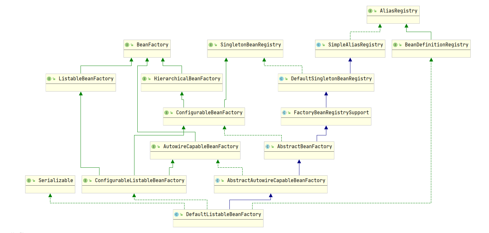
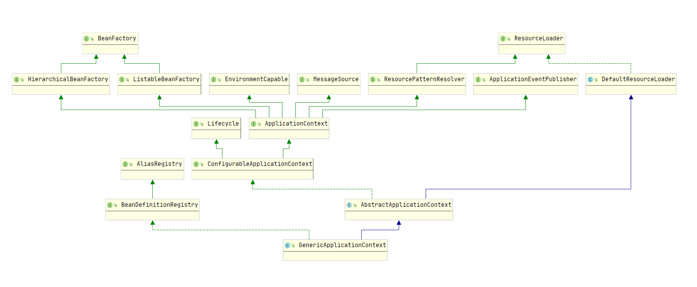

SpringFramework

## 1、spring概念

​		spring是一个轻量级的开源JAVAEE框架，用于解决企业应用开发的复杂性。有两个核心部分：

- IOC：控制反转，将创建对象的过程交给spring进行管理
- AOP：面向切面编程，通过动态代理，将一些模块化代码分离，不写入源代码

### 1.1、spring特点：

- 方便解耦；自动依赖注入，从而简化开发
- 面向切面编程，使开发者专注于业务逻辑代码的编写
- 支持对各种框架的集成
- 支持各种JAVAEE规范，并提供更加简化的API

### 1.2、spring模块划分：

spring是一个轻量化框架，通过多个模块来给开发者提供自己应用程序所需要的功能，实现JAVAEE平台的所有规范。spring主要分成六个模块：

- IOC容器
- AOP
- 数据访问与集成
- Web和远程调用
- spring测试
- Instrumentation和Messaging（使用比较少）


### 1.3、spring核心容器模块：

核心容器模块就是spring框架的基础，用于整个spring容器的搭建和使用，也是整合所有其他模块的基础，它包括：

- Beans：访问配置文件、管理创建bean、IOC容器的依赖注入
- Core：spring基本核心工具类，其他spring组件的基本核心
- Context：springIOC功能上的扩展服务：邮件服务、任务调度、JNDI定位、缓存、远程访问、视图层框架的封装等
- SpEL：spring表达式语言，spring3.0中提出，使用#{}作为定界符，用于配置Bean对象的属性注入

对应四个spring依赖包：spring-beans、spring-core、spring-context、spring-expression

## 2、IOC容器

​		IOC容器，即spring容器，实现spring的依赖注入，控制反转，整个容器的创建和使用依赖于spring的核心容器模块，因此只需要导入基础的四个依赖包

### 2.1、基本概念：

1、IOC容器设计和目的：

​		将对象创建和对象调用的过程，交给spring进行管理；从而降低对象之间的耦合

2、IOC容器的底层技术：

​			xml解析、工厂模式、反射

3、IOC容器底层原理：

- 在spring的xml配置文件中，配置IOC容器需要创建管理的对象	

- spring通过对xml解析，获取需要创建对象的信息、实例化方式和某些特定行为

- 通过反射技术，使用xml解析得到的信息创建该实例；

- 最后使用工厂模式，来提供获取该实例的方法

  因此实际上，IOC容器底层就是一个对象工厂，使用java反射技术，读取xml配置文件，提供实例化对象的方法

### 2.2、IOC容器入门：

- 整个IOC容器的搭建，需要使用spring配置文件来完成：

```xml
<?xml version="1.0" encoding="UTF-8"?>
<beans xmlns="http://www.springframework.org/schema/beans"
    xmlns:xsi="http://www.w3.org/2001/XMLSchema-instance"
    xmlns:context="http://www.springframework.org/schema/context"
    xsi:schemaLocation="http://www.springframework.org/schema/beans    
                        http://www.springframework.org/schema/beans/spring-beans-3.1.xsd 
                        http://www.springframework.org/schema/context    
                        http://www.springframework.org/schema/context/spring-context-3.1.xsd">
    
    <!-- 配置User对象 -->                    
    <bean id="user" class="com.yh.User"></bean>                                           
</beans>  
```

**根据需要使用spring模块的标签，来引入对应的XML Schema文件，定义springXML配置文件的文档结构**

- 获取IOC容器上下文，然后依赖注入获取IOC容器中的实例

```java
	public static void main(String[] args) {
		//获取IOC容器上下文
		ClassPathXmlApplicationContext context = new ClassPathXmlApplicationContext("spring.xml");
		User user = context.getBean("user", User.class);
	}
```

- 手写IOC容器工厂（简单模拟实现IOC容器）

```java
public class IocFactory {

	private static HashMap<String, Object> singleBeanMap=new HashMap<String, Object>(10);
	
    //注入Bean，省略了xml解析获取bean全类名的过程
	public static void setBean(String beanName,String className) throws ClassNotFoundException, InstantiationException, IllegalAccessException {
		Class clazz = Class.forName(className);
		boolean contains = singleBeanMap.keySet().contains(beanName);
		//保证bean对象的单例创建
		if (!contains) {
			synchronized (IocFactory.class) {
				if (!contains) {
					Object newInstance = clazz.newInstance();
					singleBeanMap.put(beanName, newInstance);
				}
			}
		}
	}
	
    //获取IOC容器中的Bean
	public static <T> T getBean(String beanName,Class<T> clazz) {
		if (!singleBeanMap.keySet().contains(beanName)) {
			System.out.println("IOC容器中不存在该"+beanName+"Bean");
		}
		T bean = (T)singleBeanMap.get(beanName);
		return bean;
	}
}
```

### 2.3、核心接口

spring容器的实现基于BeanFactory和ApplicationContext两个接口

#### 2.3.1、BeanFactory

BeanFactory是访问IOC容器的根接口，其实现类为`DefaultListableBeanFactory`,其层次结构图为：



相关主要接口作用:

- BeanFactory：实现对Bean的访问
- HierarchicalBeanFactory：继承BeanFactory接口，实现IOC容器父子关系结构
- AutowireCapableBeanFactory：继承BeanFactory接口，实现Bean自动装配功能
- ListableBeanFactory：继承BeanFactory接口，实现对Bean集合的操作
- ConfigurableBeanFactory：继承HierarchicalBeanFactory接口，额外实现SingletonBeanRegistry接口，提供单例bean的注册功能
- BeanDefinitionRegistry：实现Bean的注册
- FactoryBeanRegistrySupport ：实现FactoryBean的注册

**BeanFactory一般用于spring内部对IOC容器的管理，其实例对象使用延迟初始化策略，当程序需要访问IOC容器时，才会进行初始化；**

#### 2.3.2、ApplicationContext

ApplicationContext是BeanFactory的子接口，通过spring-context包对其进行企业化应用功能扩展，其实现类根据应用场景（是否为web应用、web实现方式）和配置实现（xml和注解）分为多种，最基础的实现类为`GenericApplicationContext`，其层次结构图为：



额外实现接口有：

- EnvironmentCapable：用于spring获取环境变量（如System配置、Servlet配置）
- MessageSource：支持国际化信息获取
- ResourceLoader：加载各种类型资源
- ApplicationEventPubisher：实现事件发布与监听功能
- LifeCycle：实现开启或关闭Bean的生命周期
- ConfigurableApplicationContext：继承ApplicationContext接口，提供一系列Application属性的配置和容器刷新、关闭功能

**ApplicationContext面向使用spring的开发者，是spring应用上下文，提供IOC容器的高级功能；默认在应用启动时，直接初始化**

GennericApplicationContext的最终实现：

- 搭配AnnotationConfigRegistry接口，实现以java注解方式配置容器

- 搭配ConfigurableWebApplicationContext接口转为webApplciationContext实例

### 2.4、IOC容器配置（XML）：

Spring支持两种IOC容器的配置方式：

- 基于XML配置

- 基于java代码和java注解配置（spring3.0引入）

#### 2.4.1、Bean注册

IOC容器提供两种类型Bean的创建，Bean和FactoryBean

##### 2.4.1.1、Bean标签

通过构造方法来创建Bean实例，默认使用无参构造方法

```xml
<bean id="user" class="com.yh.User" name="userA;userB"></bean>
```

**bean标签基本属性：**

| 属性  | 描述                                                        |
| ----- | ----------------------------------------------------------- |
| id    | bean的唯一标识符                                            |
| name  | bean的别名，可以指定多个别名（spring5后，name别名不能重复） |
| class | bean的全类名，必填                                          |

注意：

- id的默认值：

  1、id和name都不指定时，IOC容器默认使用class作为id

  2、只指定name时，IOC容器使用第一个nane作为id

- id和name都可以作为getBean方法参数，来获取Bean，一般推荐使用id

##### 2.4.1.2、Property标签：

property标签用于bean属性注入，但需要保证bean提供属性的set方法

```xml
<bean id="user" class="com.yh.User">
	<property name="name" vlaue"yh"/>
    <property name="gread" ref="gread">
</bean>
```

**property标签属性：**

| 属性  | 描述                                                      |
| ----- | --------------------------------------------------------- |
| name  | 属性名，支持级联注入，但需要保证级联对象已被注入          |
| value | 属性值，只支持基础数据类型                                |
| ref   | 属性值，用于将IOC容器的bean作为属性进行注入，通过id来引入 |
| idref | 属性值，代替ref，在xml中校验指定bean是否在IOC容器中存在   |

**property标签嵌套bean标签：**

property标签嵌套bean标签，来直接创建引用数据类型属性的值，但该bean只作用于上层bean，无法从IOC容器中获取

```xml
<property name="gread" >
    <bean  class="com.yh.Gread">
		 <property name="id" value="1" />
		 <property name="math" value="98" />
		 <property name="english" value="100" />
    </bean>
</property>
```

spring提供一系列常用集合、特殊值的标签，方便属性注入：

```xml
<property name="name">
	<null/>
</property>

<property name="arrayId">
	<array>
		<value>111</value>
	</array>
</property>

<property name="listId">
	<list>
		<value>11</value>
	</list>
</property>

<property name="mapId">
 	<map> 
 		<entry key="1">
            <value>abc</value>
        </entry>
	</map>
</property>  

<property name="listId" >
 	<map> 
 		<entry key="1">
            <ref bean="user"/>
        </entry>
	</map>
</property>  

<property name="propId">
    <props>
         <prop key="name">yh</prop>
    </props>
</property>
```

##### 2.4.1.3、Constructor-arg标签

通过有参构造方法创建Bean，从而完成属性注入

```xml
<bean id="user" class="com.yh.User"  name="userA;userB" >
      <constructor-arg name="name" type="String" value="yh"></constructor-arg>
</bean> 
```

Constructor-arg提供两种参数指定方式：

- name：指定参数名来匹配构造方法
- index：通过参数列表索引匹配构造方法

两种方式可以同时使用，但可能存在无法确认唯一构造方法的情况，因此一般情况下，推荐额外添加type属性来指定参数类型

**constructor-arg属性值配置方式和property一致**

##### 2.4.1.4、FactoryBean

bean标签支持对FactoryBean的创建，并分为两种方式：

- 工厂静态方法实例化

```xml
<bean id="user" class="com.yh.UserFactory" factory-method="createInstance"/>
```

````java
public class UserFactory {
	private static User user = new User();

	public static User createInstance() {
		return user;
	};
}
````

factroy-method用于指定Bean对应工厂类的实例获取方法，并需要保证该方法为static

- 工厂对象方法实例化：

```xml
<bean id="userFactory" class="com.yh.UserFactory"/>

<!-- 使用factory-bean时，需要保证class属性为空，即当前bean的类型，交给工厂Bean决定 -->
<bean id="user" factory-bean="userFactory" factory-method="createInstance"/>
```

```java
public class userFactory {
    private User User = new User();

    public  User createInstance() {
        return clientService;
    }
}
```

- 通过constructor-arg子标签，完成工厂类中实例获取方法的属性注入

```xml
<bean id="user" class="com.yh.UserFactory" factory-method="createInstance">
    <constructor-arg name="name" value="yh111"></constructor-arg>
</bean
```

```java
public class UserFactory {
	private static User user = new User();

	public static User createInstance(String name) {
        user.setName(name);
		return user;
	};
}
```

##### 2.4.1.5、额外命名空间

spring对于xml方式的配置，提供一系列属性注入方式的简化：

- 引入P命名空间：简化xml中property标签的使用，实现属性注入时根据实现类的set方法，进行xml属性自动提示
- 引入util命名空间：用于在IOC容器中配置集合Bean，来代替ListFactoryBean、MapFactoryBean、SetFactoryBean、PropertiesFactoryBean对象方式创建集合Bean
- 引入C命名空间：简化constructor-arg标签的使用，实现在Bean标签中，使用内联属性进行构造函数参数的声明（spring3.1引入）

#### 2.4.2、Bean行为配置

IOC容器对Bean提供了作用域、生命周期、依赖关系的行为配置

##### 2.4.2.1、作用域

spring提供Bean的六个作用域，通过Bean标签的属性Scope设置

| 作用域                    | 描述                                                         |
| ------------------------- | ------------------------------------------------------------ |
| singleton（单实例）       | 默认值，作用在spring容器中，保证实例唯一                     |
| prototype（原型，多实例） | 作用在spring容器中，每次获取bean都会实例化一个新对象         |
| request                   | 作用在当前web应用的request请求中，每个request请求都会实例化一个新对象 |
| session                   | 作用在当前web应用的session中，每个session都会实例化一个新对象 |
| application               | 作用在当前web应用中，保证实例唯一                            |
| websocket                 | 作用在在当前Websocket连接中，即每个Websocket连接都会实例化一个新对象 |

**单例和原型使用场景：**

1、单例：

​		适合于无状态Bean，即Bean实例化对象不保存当前线程使用的数据，线程安全；如DAO层（数据方法对象）、service层（业务逻辑对象）

2、原型：

​		适合于有状态Bean，每个Bean实例化对象都保存了当前线程的数据信息，伴随调用者的消亡而消亡；并且在被IOC容器创建后，就不会被IOC容器管理，因此其Bean定义的销毁方法也不会被执行，需要开发者手动进行原型Bean中的资源释放

注意：

- request、session、application和websocket作用域并不能在spring常规IOC容器中定义，否则会抛出IllegalStateException异常，未知bean作用域；它们只用于web项目中的IOC容器

- 

- 单例Bean依赖于原型Bean时，会将原型Bean的作用域改为单例

  可以通过手动注入方式，来避免IOC容器修改原型Bean的作用域

- 原型Bean依赖于单例Bean时，始终使用同一个单例Bean

##### 2.4.2.2、生命周期

Bean的生命周期简单分为5个过程：

| 生命周期       |
| -------------- |
| 调用构造方法   |
| 属性注入       |
| 调用初始化方法 |
| 调用销毁方法   |
| 销毁           |

IOC容器能够实现Bean生命周期的方法回调：

- 初始化方法回调：

  在Bean完成属性注入后，实现无参初始化方法的回调

  ```xml
  <bean id="user" class="com.yh.User" init-method="init" />
  ```

- 销毁方法回调：

  在Bean销毁之前，实现无参销毁方法的回调

  ```xml
  <bean id="user" class="com.yh.User" destroy-method="destroy" />
  ```

bean标签的父标签beans，提供全局初始化方法、销毁方法的配置：

```xml
<beans default-init-method="init" default-destroy-method="destroy">
```

**IOC容器关闭时，会销毁所有Bean，然后调用registerShutdownHook方法**

##### 2.4.2.3、循环依赖、延迟加载、强制依赖

bean的加载顺序由bean直接的依赖关系决定：

- IOC容器初始化时，会验证每一个Bean的配置，并优先加载所有的非延迟加载的Bean

  注意：原型Bean为懒加载，单例Bean默认为非延迟加载

- 但两个Bean存在依赖关系时，IOC容器会优先实例化被依赖的Bean，从而完成另外一个Bean的属性注入

**在Bean依赖关系中，存在循环依赖问题：**

​		A的创建依赖于B，B的创建又依赖于A；spring对这种问题提供了解决方式，但前提是循环依赖关系不能在bean的实例化阶段构造，只能在属性注入阶段，否则将抛出BeanCurrentlyInCreationException异常

**延迟加载：**

​		Bean标签提供lazy-init属性，指定bean是否延迟加载；

```xml
<bean id="user" class="com.yh.User" lazy-init="true"/>
```

注意：

- 延迟加载并不会影响bean的注册，当该bean被需要加载的bean依赖时，则按顺序进行正常加载


**强制依赖：**

​		当Bean依赖关系不太直接时，IOC容器则无法严格确定bean的加载顺序，比如：

A依赖于B，B相关属性的有效值通过C的初始化方法来实现重新赋值，此时B优先于A加载，而B和C没有直接的依赖关系，但却需要保证C加载优先A，否则会导致A初始化使用B相关属性的值

​		Bean标签提供depends-on属性，可以显式强制当前Bean要在指定Bean后面加载，如user需要在gread后加载：

```xml
<bean id="user" class="com.yh.User" depends-on="gread"/>
<bean id="gread" class="com.yh.Gread" />
```

#### 2.4.3、Bean自动装配:

​		Bean标签通过Property、Constructor-arg子标签来完成手动属性注入，但也可以通过autowire属性来进行自动装配，即根据某种规则，自动匹配IOC容器中的Bean来作为value进行属性注入

​		和手动属性注入类似，spring提供两种自动装配方式：基于属性的自动装配、基于构造方法的自动装配

##### 2.4.3.1、基于属性的自动装配

​		IOC容器会根据当前Bean类中**提供了setter方法的属性**，来对其进行自动注入：

```xml
<Bean id="gread" class="com.yh.Gread"/>  

<!-- 自动注入gread-->
<Bean id="user" class="com.yh.User" autowire="byNmae"/>
<Bean id="user" class="com.yh.User" autowire="byType"/>
```

1、autowire为byName时，寻找IOC容器中bean id和属性名相同的Bean实例，进行注入

2、autowire为byType时，寻找IOC容器中bean class和属性类型相同的Bean实例，进行注入；

注意：

- 自动装配不能和手动注入同时使用，因此**基于属性的自动装配只能使用无参构造方法**，如果没有则会抛出异常

##### 2.4.3.2、基于构造方法的自动装配

​		spring会根据如下策略，选取构造方法，根据参数类型匹配bean，完成自动装配：

1、获取所有构造方法，进行排序：参数多的优先、权限修饰符为public的优先

2、对于参数个数相同、权限修饰符相同的构造方法，比较参数类型的差异性（差异性高的优先）

3、对所有构造方法进行遍历，找到第一个满足IOC容器注入条件的构造方法，进行实例化和自动装配

```xml
<Bean id="gread" class="com.yh.Gread"/> 

<!-- 自动注入gread-->
<Bean id="user" class="com.yh.User" autowire="constructor"/>    
```

**注意：**

- 自动装配无法完成简单数据类型属性的注入

- 使用property、constructor-arg标签，进行手动属性注入后，会使自动装配失效

- 当使用属性类型（构造方法参数类型）进行Bean匹配时，如果IOC容器匹配到多个相同类型bean，则会抛出异常；可以使用Bean标签的primary，来标记在该类型所有Bean中，当前bean优先匹配（注意同类型bean中，只能指定一个）

  ```java
  <Bean id="gread" class="com.yh.Gread" primary="true"/>
  ```

#### 2.4.4、IOC容器基本注解

spring2.0中，引入一系列java注解，来简化Bean的注入，需要额外在spring.xml引入context命名空间：

```xml
<context:annotation-config />
```

此时IOC容器中，会自动创建如下Bean，用于开启IOC容器注解：

| Bean类型                                 | 作用                                                         |
| ---------------------------------------- | ------------------------------------------------------------ |
| internalConfigurationAnnotationProcessor | 处理用于注册Bean的注解（**@Component、@ComponentScan、@Bean . . **） |
| internalAutowiredAnnotationProcessor     | 处理**@Autowired注解**                                       |
| internalCommonAnnotationProcessor        | 处理带有**JSR-250规范注解**                                  |
| internalEventListenerProcessor           | 事件监听处理器                                               |
| internalEventListenerFactory             | 事件监听工厂                                                 |

##### 2.4.4.1、@Component系列注解

spring2.0提供@Component系列相关注解，来注册bean：

| 注解        | 描述              |
| ----------- | ----------------- |
| @Component  | 注册通用Bean      |
| @Controller | MVC控制层Bean     |
| @Service    | MVC服务层Bean     |
| @Reposity   | MVC数据访问层Bean |

注意：

- @Controller、@Service、@Reposity为包含@Component的组合注解，实际还是通过@Component注解来起到注册bean的作用；通过导入spring-web模块，IOC容器会通过它们进行AOP代理，从而对Bean进行额外处理
- @Component系列注解默认使用类名（转为驼峰模式）的作为bean的id，可以使用value属性自定义

**开启@Component注解：**

```xml
<context:component-scan base-package="com.yh" />
```

- 开发者需要手动指定扫描哪些包内的@Compoent注解，否则所有@Component注解都不会生效

- 在开启Component扫描时，默认也会隐式开启IOC容器注解功能（context:annotation-config）

- 在context:component-scan标签下，spring提供context:include-filter、context:exclude-filter子标签，来选择或过滤@Component类型：

  一般情况下，两种方式任选其一，以web项目为例，需要对单独扫描@Controller注解放入IOC-web子容器，非@Controller注解放入IOC父容器：

  ```xml
  <context:component-scan base-package="com.yh.controller"  use-default-filters="false">
  	   <context:include-filter type="annotation" 		expression="org.springframework.stereotype.Component"/>
  </context:component-scan>
  
  <context:component-scan base-package="com.yh"  >
  	   <context:exclude-filter type="annotation" expression="org.springframework.stereotype.Controller"/>
  </context:component-scan>
  ```

  use-default-filters默认为ture，即匹配扫描@Component系列注解，一般搭配context:exclude-filter来排除其中的某些注解

  use-default-filters=false则搭配context:include-filter，给开发者手动选择需要匹配的@Component系列注解

#### 2.4.5、导入外部properties文件

spring通过context:property-placeholde标签，来导入properties文件，同时IOC容器中会创建`PropertySourcesPlaceholderConfigurer`实例，用于使用@Value注解进行外部属性注入

```xml
<context:property-placeholder location="classpath:jdbc.properties">
```

注意：

- 当所有properties文件不存在@Value指定值时，会报错；出现多个时，会按照文件加载顺序，选取优先值

### 2.5、IOC容器配置注解

spring3.0中，提供java注解的方式来代替xml配置

#### 2.5.1、@Configuration

spring提供@Configuration注解，来声明配置类，完全代替spring.xml，并开启IOC容器注解功能

- 加载配置类：

  ```java
  public static void main(String[] args) {
      ApplicationContext ctx = new AnnotationConfigApplicationContext();
      ctx.register(AppConfig.class);
      ctx.register(OtherConfig.class,AdditionalConfig.class);
      ctx.refresh();
  }
  ```

  使用ApplicationContext实现类（`AnnotationConfigApplicationContext`）进行配置文件的加载；

**或者使用@Import注解，在一个配置类上加载其他配置类（即当前为主配置类）**

@Configuration同时也是包含@Component的组合注解，在

#### 2.5.2、@Bean：

除了spring2.0提供的@Component系列注解进行Bean注册外，spring3.0提供@Bean来进行Bean注册：

 ```java
@Component
public class UserFactory {
	
	@Bean
	public static User getUser() {
		User user = new User();
		user.setName("yh123");
		return user;
	}

	@Bean
	public  User createInstance(@Value("${name}")String name,@Qualifier("user")User user) {
		user.setName(name);
		return user;
	};
}
 ```

注意：

- @Bean注解的方法参数会使用IOC容器进行依赖注入，默认通过参数名进行匹配Bean的id，也可以使用@Qualifier自定义
- @Bean默认使用方法名作为Bean的name（别名），可以通过name属性指定多个；根据别名和id的关系，默认选择第一个作为Bean的id
- 一个类中所有@Bean注释的方法，会按照其声明顺序进行bean注册；当@Bean方法之间存在依赖注入时，则按照依赖关系进行bean的注册
- @Bean注解提供initMethod、destroyMethod属性，指定该Bean生命周期的回调方法

#### 2.5.3、@Autowired

#### 2.5.4、@Value

#### 2.5.5、配置类相关注解

spring3.0通过@Configuration注解来代替spring.xml配置文件,关于相关配置标签都提供对应的注解，并且**必须搭配@Configuration一起使用**

##### 2.5.6.1、@ComponentScan

@ComponentScan代替context:component-scan标签，开启@Component注解功能

常用属性：

| 属性名            | 描述                                                         |
| ----------------- | ------------------------------------------------------------ |
| basePackages      | 定义扫描路径，为string[]，可以定义多个路径                   |
| value             | basePackages属性别名，作为默认值                             |
| excludeFilters    | 黑名单过滤器                                                 |
| includeFilters    | 白名单过滤器                                                 |
| useDefaultFilters | 是否使用默认过滤器；默认为true，注册路径中所有带有@Component及其子注解的类 |

```java
//如：排除controller注解的类
@Configuration
@ComponentScan(basePackages= {"com.yh"},excludeFilters= {
		@Filter(type=FilterType.ANNOTATION,classes= {Controller.class})})
public class myConfig{
}
```

##### 2.5.6.2、@PropertySource

@PropertySource代替context:property-placeholder标签，导入外部properties文件

常用属性：

| 属性名                 | 描述                                                         |
| ---------------------- | ------------------------------------------------------------ |
| name                   | 资源命名（一般不需要）                                       |
| value                  | 外部资源路径                                                 |
| encoding               | 编码格式，默认使用项目编码格式                               |
| ignoreResourceNotFound | 是否忽略找不到指定值；默认false，不忽略                      |
| factory                | 定义PropertySources的生成规则，默认PropertySourceFactory.class |

```java
@Configuration
@PropertySource("classpath:/my.properties")
public class myConfig{
}
```

注意：

- ignoreResourceNotFound，一般使用默认值false，降低异常发生时的排除难度

##### 2.5.6.3、@Import

一种区别于@Component、@Bean的，额外注册Bean的注解，用于直接将第三方类实例加载到IOC容器中，使用类名（转为驼峰模式）作为Bean的id

**相对于@Bean更加简单，但只能使用默认构造方法进行实例化，没有则会报错**

```java
@Configuration
@Import({User.class})
public class myConfig{
}
```

#### 2.5.6、JSR-250规范注解

spring兼容JSR-250规范，来控制Bean的注入和生命周期回调

##### 2.5.6.1、@Resource

作用和@Autowired+@Qualifie类似，通过id、类型从IOC容器中获取bean

```java
public class SimpleMovieLister {

    @Resource
    private MovieFinder movieFinder;

    @Resource
    public void setMovieFinder(MovieFinder movieFinder) {
        this.movieFinder = movieFinder;
    }
}
```

@Resource提供name、type属性来指定Bean的id和类型，策略如下：

- 同时指定name、type，则使用id和类型匹配唯一Bean，找不到则抛出异常
- 只指定name，则使用id匹配唯一Bean，找不到则抛出异常
- 只指定type，则使用类型匹配唯一Bean，找到多个或0个则抛出异常
- 都不指定时，则默认使用属性名/参数名作为id匹配唯一Bean，如果匹配不到则使用属性类型/参数类型匹配，找到多个或0个则抛出异常

##### 2.5.6.2、@PostConstruct、@PreDestroy

定义Bean生命周期中初始化和销毁的回调方法

```java
public class CachingMovieLister {

    @PostConstruct
    public void init() {
        
    }

    @PreDestroy
    public void destroy() {
       
    }
}
```

- 它们和xml中Bean生命周期回调方法配置一样， @PostConstruct注解方法在Bean完成属性注入后执行，@PreDestroy在Bean销毁前执行
- 它们注解的方法，可以和xml中的Bean生命周期回调方法同时存在并执行（两种配置不冲突，但不推荐，因为不太确定它们的执行顺序）

#### 2.5.7、其他注解（不常用）

##### 2.5.7.1、Bean行为相关注解

用于代替Bean标签中Scope、Lazy和DependsOn属性，搭配@Component、@Bean一起使用

| 注解       | 作用                                                         |
| ---------- | ------------------------------------------------------------ |
| @Scope     | 和@Component、@Bean一起使用，定义Bean注册时的作用域，默认为singleton |
| @Lazy      | 和@Component、@Bean一起使用，使bean的初始化延迟，getBean时才进行加载，默认为true |
| @DependsOn | 和@Component、@Bean一起使用，定义该bena的初始化，要在指定bean完成之后进行 |

##### 2.5.7.2、JSR-330注解

| 注解                  | 等效spring注解      |
| --------------------- | ------------------- |
| @Inject               | @Autowired          |
| @Named / @ManagedBean | @Component          |
| @Singleton            | @Scope("singleton") |
| @Qualifier / @Named   | @Qualifier          |

##### 2.5.7.3、@Required

@Autowired的required属性作用类似，只能注解在set方法上，搭配xml配置方式使用，表示当前Bean使用xml注册时，必须保证该set方法属性被注入，默认为true


**spring 提供@Autowired、@Qualifier、@Value来完成Bean的属性注入**

##### @Autowired（@Qualifier、@Primary）

可以注解在构造方法、普通方法和成员变量上，来完成Bean的自动装配

```java
@Component
public class User {

    @Autowired
    private Gread gread;
    
    @Autowired
    public User(Gread gread){
     	this.gread=gread;   
    }
    
    @Autowired
    public void setGread(Gread gread) {
        this.gread=gread; 
    }
}
```

- 通过三种方式来实现IOC容器的自动装配：

1、构造方法：当User类被IOC容器创建时，则会使用User构造方法，将IOC容器中的Gread实例作为参数属性注入

2、普通方法：当User类被IOC容器创建后，会继续执行被@Autowired的普通方法，将IOC容器中的Gread实例作为参数，将进行属性注入

3、成员变量：@Autowired注解在成员变量上时，**不需要为该类添加当前成员变量的setter方法**；当User类被IOC容器创建后，会将IOC容器中的Gread实例，**使用反射的方式进行属性注入**

**@Autowired不能注解在静态成员变量和静态方法上，否则spring进行错误提示，无法起作用；而对于静态成员变量的属性注入，只能通过手动编写注入方法（普通方法、构造方法）并添加@Autowired注解来完成**

- @Autowired有一个唯一属性required，默认为true；当自动装配在IOC容器中没有查询到可以匹配的bean时，会抛出异常；而当设置required=false时，就会忽略异常不进行当前的自动装配

- @Autowired自动装配默认使用byType，当IOC容器中存在多个bean时，**则默认使用参数名/变量名指定注入Bean的唯一id，如果没有匹配则报错存在多个同类型Bean**；我们也可以通过**@Qualifier**注解来，手动指定注入Bean的唯一ID；或者在多个相同类型Bean中，选择一个Bean作为默认值，添加**@Primary**注解

  ```JAVA
     	@Qualifier("gread")
  	@Autowired
      private Gread gread;
      
      @Autowired
      public User(@Qualifier("gread") Gread gread){
       	this.gread=gread;   
      } 
  ```

- 自动装配时，构造方法的选择：
  1. 当不使用@Autowired不指定构造方法时：
     - 只有一个构造方法：则直接使用该构造方法
     - 有多个构造方法：则使用默认构造方法（无参构造方法），没有就会报错
  2. 当使用@Autowired指定构造方法时：
     - 只指定一个构造方法：则使用该构造方法；当设置required为false时，该构造方法参数无法通过IOC容器依赖注入时，则会使用默认构造方法
     - 指定了多个构造方法：必须保证所有@Autwired属性required为false，即允许当前构造方法匹配不到Bean，这样spring就在所有注解的构造方法中，选择一个构造方法来实例化Bean（**选择策略和xml基于构造方法自动装配的一致**）

- @Autowired的额外功能：获取容器中所有当前类型的Bean实例，使用数组、集合进行保存

  ```java
  @Component
  public class MovieRecommender {
  
      @Autowired
      private MovieCatalog[] movieCatalogs;
      
      @Autowired
      private Set<MovieCatalog> movieCatalogs;
      
      @Autowired
      private Map<String, MovieCatalog> movieCatalogs;
      
      // ...
  }
  ```

  对于Map存储，key为当前Bean的id、value为当前Bean实例对象；所有集合元素的排序，遵循它们的注册顺序，但是@Priority注解的Bean会默认排序第一位；而@Order注解，可以修改注册优先级，但并不会影响Bean的实例化顺序（**注意：@Order不能注解在方法中，因此无法改变@bean方法的注册优先**级）

- spring可以通过@Autowired注解，直接进行springIOC容器API接口的实例化创建，如`BeanFactory`，`ApplicationContext`，`Environment`，`ResourceLoader`， `ApplicationEventPublisher`，和`MessageSource`。这些接口及其扩展接口（例如`ConfigurableApplicationContext`或`ResourcePatternResolver`）

  ```JAVA
  	@Autowired
  	public  ApplicationContext context;
  ```

##### @Value

@Value可以注解在带有@Autowired注解的方法中、成员变量中，用于字面量的属性注入；**在注解在成员变量上时，不需要set方法，会使用反射的方式进行属性注入**

- ${}方式：

  ```java
  @Value("${name}")
  private String name;
  ```

  1. 首先引入外部properties文件
  2. 在指定方法参数或成员变量上，添加@Value注解
  3. spring会自动通过注解值，在所有外部properties文件中，选择该key；找到则进行自动注入，找不到则使用注键值的字面量（即name）

  如果需要严格控制不存在的值时，则需要声明一个**PropertySourcesPlaceholderConfigurer**bean，此时如果找不到，则会在spring初始化时报错

  ```java
  @Configuration
  public class SpringConfig {
  
       @Bean
       public static PropertySourcesPlaceholderConfigurer propertyPlaceholderConfigurer() {
             return new PropertySourcesPlaceholderConfigurer();
       }
  }
  ```

- #{}方式，使用SpEL表达式，进行动态属性注入

  通过SpEL表达式，可以是实现复杂数据结构对象的属性注入

  ```java
  @Value("#{{'math':100,'english':99}}")  
  private  Map<String, Integer> countOfMoviesPerCatalog;
  ```

@Value和@Autowired一样，也无法注解在静态变量和静态方法上，因此静态变量的属性注入，可以通过set方法来完成

### spring注解使用注意事项：

#### 1、@Bean和@Component的使用：

​		两者都可以定义bean：@Component只能声明式的定义Bean，Bean的创建过程完全交给IOC容器，通过构造方法完成；而@Bean可以有效的显式控制Bean的创建过程，并进行Bean实例对象的配置；

​		对于我们自己定义的类，一般完全就可以使用@Component来定义Bean；但对于第三方库包，由于不能直接修改源码，因此只能使用@Bean来定义相应类的Bean，并设置该实例对象的属性

​		**@Bean方法创建返回的实例，其生命周期会满足该类本身的生命周期配置（即实例还会执行自身属性注入、初始化方法和销毁方法）**

#### 2、@Component和@Configuration的区别：

​		在测试中，我们可以发现@Component和@Configuration都可以搭配@Bean进行Bean的注册；但实际上，两者有本质的区别：

​	@Configuration是一个全配置类，在注册到IOC容器中后，会创建一个CGLIB的动态代理类，作为其初始化实例；此时在执行@Bean方法时创建Bean实例时，会执行方法拦截器，将配置类的@Bean方法间出现的依赖调用，转化为先从IOC容器中获取，没有则直接执行依赖方法的Bean创建，然后获取其实例化对象，进行当前方法的Bean创建，有效避免出现多个对象创建

```java
	@Bean("userB")
	public  User getUserB() {
		System.out.println("b前");
		User user = new User();
		user.setName("yh123B");
		System.out.println("b后");
		return user;
	}

	@Bean("userA")
	public  User getUserA() {
		System.out.println("a前");
        User user = getUserB();
		user.setName("yh123A");
		System.out.println("a后");
		return user;
	}
```

​	@Component则会正常进行的@Bean方法，来创建Bean实例；当出现@Bean方法间的依赖调用时，就会创建多个对象，即一个Bean的创建依赖于另一个Bean，但实际IOC容器中该Bean中依赖的对象实例，和IOC容器中的存在的对象实例不相同

​	当然，对于@Component的缺点，可以使用方法参数注入的方式解决:

```java
	@Bean("userB")
	public  User getUserB() {
		System.out.println("b前");
		User user = new User();
		user.setName("yh123B");
		System.out.println("b后");
		return user;
	}

	@Bean("userA")
	public  User getUserA(@Qualifier("userB")User user) {
		System.out.println("a前");
		System.out.println(user);
		user.setName("yh123A");
		System.out.println("a后");
		return user;
	}
```

#### 3、@Bean注解普通方法和静态方法的区别：

@Bean可以注解在普通方法和静态方法，**对于静态@Bean的实例化，不会触发当前配置类的实例化**；因此在使用@Bean方式添加BeanPostProcessor、BeanFactoryPostProcessor时，该bean会在spring所有Bean初始化之前，提前实例化使用，因此当不声明为静态方法时，就会导致当前配置类提前实例化，从而无法进行spring的色号给生命周期，无法完成依赖注入

**即一般Bean直接使用普通方法；对于BeanPostProcessor、BeanFactoryPostProcessor这些需要提前实例化、不参与spring生命周期的Bean，则使用静态方法**

#### 4、@Bean和@Component出现beanName相同时：

由于IOC容器是先处理@ComponentScan注解，来注册使用@Component声明的Bean，因此其优先度高（相同优先度，出现同一BeanName时，会直接初始化报错），因此在@Bean出现相同beanName时，优先级底，会直接忽略不进行注册

### IOC容器的常用回调接口（仅spring）：

**IOC容器的所有回调接口在实现时，都需要添加@Component注解，从而被IOC容器管理，spring才能进行其方法的回调**

**所有回调接口的实现，都是基于对于Bean或spring相关对象的AOP增强，进行前置、后置通知**

#### Aware接口

定义向bean提供容器的基础信息

##### BeanClassLoaderAware

获取spring使用的类加载器

```java
public interface BeanClassLoaderAware extends Aware {
	void setBeanClassLoader(ClassLoader var1);
}
```

##### ResourceLoaderAware

获取spring的资源加载器，来手动加载外部资源

```java
public interface ResourceLoaderAware extends Aware {
	void setResourceLoader(ResourceLoader var1);
}
```

##### BeanNameAware

获取当前Bean被IOC容器管理使用的id(name)

```java
public interface BeanNameAware extends Aware {
	void setBeanName(String name);
}
```

##### BeanFactoryAware

获取IOC容器的BeanFactory对象，并可以转化为已知子类，进行Bean的生产和管理

```java
public interface BeanFactoryAware extends Aware {
	void setBeanFactory(BeanFactory var1) throws BeansException;
}
```

##### ApplicationContextAware

和BeanFactoryAware类似，获取IOC容器的上下文（ApplicationContext），并可以转化为已知子类，在BeanFactory基础上提供额外操作

```java
public interface ApplicationContextAware extends Aware {
	void setApplicationContext(ApplicationContext var1) throws BeansException;
}
```

除此之外，还提供了直接使用ApplicationContext额外操作的接口（可以直接通过ApplicationContext实现）

- MessageSourceAware：用于国际化资源解析

- ApplicationEventPublisherAware：用于事件发布

#### IOC容器扩展接口

##### BeanPostProcessor

定义了IOC容器中所有Bean初始化方法前后所执行的逻辑

**配置方式：**BeanPostProcessor接口的实现类，可以直接像普通Bean一样，将其放入IOC容器，ApplicationContext会进行自动检测和配置；但需要注意：当使用@Bean注解来声明时，返回值类型应该为BeanPostProcessor，否则spring无法实现自动检测

两个方法，提供当前Bean的实例对象和beanName，需要将实例对象返回，在此期间可以对实例对象进行操作

```java
public interface BeanPostProcessor {
	Object postProcessBeforeInitialization(Object var1, String var2) throws BeansException;

	Object postProcessAfterInitialization(Object var1, String var2) throws BeansException;
}
```

**优先级：**可以定义多个接口实现类，通过@Order注解，来定义Bean的注册顺序，从而定义处理器执行的优先级

##### BeanFactoryPostProcessor

定义了IOC容器完成Bean注册后，所执行的逻辑

**配置方式：**同样和BeanPostProcessor一样，放在IOC容器中，被自动扫描配置

提供BeanFacotry的实例化对象，用于对Bean配置元数据（**BeanDefintion**）进行操作

```java
public interface BeanFactoryPostProcessor {
	void postProcessBeanFactory(ConfigurableListableBeanFactory var1) throws BeansException;
}
```

**优先级：**可以定义多个接口实现类，通过@Order注解，来定义Bean的注册顺序，从而定义处理器执行的优先级

##### FactoryBean

实现XML中的工厂bean，定义bean的实例化逻辑，但只能有一个产品类；**用于创建实例化逻辑比较复杂的Bean**

提供了三个方法，getObject（）用于提供产品类Bean的实例化对象；getObjectType（）用于提供产品类的类型；isSingleton（）提供产品类是否为单例（默认为单例，则不需要重写返回true）

```java
public interface FactoryBean<T> {
	T getObject() throws Exception;

	Class<?> getObjectType();

	boolean isSingleton();
}
```

对于工厂Bean，进行注册时，ID会添加&前缀；在获取工厂Bean和其产品Bean的方式也就有区别：

```java
	User user = context.getBean("userBeanFactory",User.class);

	UserBeanFactory bean = context.getBean("&userBeanFactory",UserBeanFactory.class)
```

**FactoryBean和@Bean的本质区别：**

它们相对于@Compenton注解，都可以显式的定义bean的实例化逻辑，但侧重点不同：@Bean是用于解决第三方类注册Bean的问题；而FactoryBean是用于创建实例化逻辑比较复杂的Bean，相对于@Compenton自动装配、手动注入和调用初始化方法，这种方式更加优雅

### IOC容器源码解析（注解版）

#### IOC容器内部功能实现的常用对象：

##### GennericBeanDefinition：

​	**BeanDefintion**的实现类，IOC容器进行Bean注册后的生成的对象，用于保存当前bean的类信息（类名、类calss对象。。）和bean定义信息（作用域、懒加载、自动装配Mode、是否为工厂Bean。。。）

##### DefaultListableBeanFactory：

​	**BeanFactory**的最常用实现类，IOC容器的核心类，实现Bean的生产和获取，常用成员变量有（**子类还有其他属性**）：

- beanDefinitionNames：所有bean注册名称列表，按注册顺序排序
- singletonBeanNamesByType：所有单例bean其类型和beanNames的 K-V映射
- allBeanNamesByType：所有bean其类型和beanNames的 K-V映射
- beanDefinitionMap：所有bean其beanName和BeanDefintion的K-V映射

beanName和beanNames的区别：beanName为bean在IOC容器中的唯一标识符（即ID），beanNames为bean的id和别名的集合（默认使用第一个值作为id）

##### ConfigurableListableBeanFactory ：

​	**postProcessBeanFactory**的实现类，其postProcessBeanFactory方法在**Bean注册完成后**执行，并能获取当前上下文中的BeanFactory，修改所有**BeanDefintion**的属性

##### BeanDefinitionRegistryPostProcessor:

​	为BeanFactoryPostProcessor接口的子接口，额外提供了postProcessBeanDefinitionRegistry，用于完成Bean的注册，其实现类为**ConfigurationClassPostProcessor**

##### BeanPostProcessor：

​	IOC容器的一个重要接口，提供了postProcessBeforeInitialization、postProcessAfterInitialization两个方法，参数为Bean实例化对象和BeanName，在bean初始化方法执行之前（创建Bean实例后）和之后执行；用于实现操作管理springBean的整个初始化过程（如属性注入）

##### DefaultSingletonBeanRegistry：

​	为**BeanFactory**的中间实现类，实现IOC容器单例Bean的初始化管理，其成员变量有：

- singletonObjects：存放所有单例Bean的初始化对象（初始化完成的），也称之为IOC容器的单例池

- earlySingletonObjects：存放所有单例Bean的实例化对象（没有进行属性注入的），用于解决循环依赖

  其子类FactoryBeanRegistrySupport，实现了工厂Bean产品类的初始化管理，其成员变量有：

  - factoryBeanObjectCache：存放工厂Bean中的单例产品Bean的初始化对象

#### 1、初始化spring环境（IOC容器）

```java
AnnotationConfigApplicationContext context = new AnnotationConfigApplicationContext(springTest.class);
```

- 调用其父类**GenericApplicationContext**默认构造方法,初始化一个**beanFactory**

  ```java
  this.beanFactory = new DefaultListableBeanFactory();
  ```

- 调用**AnnotationConfigApplicationContext**自身默认构造方法，初始化**reader**、**scanner**成员变量

  ```java
  this.reader = new AnnotatedBeanDefinitionReader(this);
  this.scanner = new ClassPathBeanDefinitionScanner(this);
  ```

  - AnnotatedBeanDefinitionReader初始化,创建**读取器**，完成IOC内置Bean的注册和IOC容器中的一些处理器配置（这些bean和处理器都是用于处理spring注解）

    ```java
    //注册spring内置的注解处理器（会进行初始化）
    AnnotationConfigUtils.registerAnnotationConfigProcessors(this.registry);
    ```
  
    **配置处理器：**
  
    - AnnotationAwareOrderComparator   解析@Order、@Priority注解
    - ContextAnnotationAutowireCandidateResolver  提供延迟加载功能
  
    **注册内置Bean：**
  
    | 内置Bean类型                         | 接口类型                   | 作用                                         |
    | ------------------------------------ | -------------------------- | -------------------------------------------- |
    | ConfigurationAnnotationProcessor     | BeanFactoryPostProcessor   | 用于完成Bean的注册                           |
    | AutowiredAnnotationBeanPostProcessor | BeanPostProcessor          | 处理@Autowired注解，完成Bean的属性注入       |
    | CommonAnnotationBeanPostProcessor    | BeanPostProcessor          | 处理@PostConstruct和@PreDestroy还有@Resource |
    | PersistenceAnnotationProcessor       | BeanPostProcessor          | 处理JPA注解（需要导入spirng-orm包）          |
    | EventListenerMethodProcessor         | ApplicationContext额外功能 | 处理事件监听                                 |
    | DefaultEventListenerFactory          | EventListenerFactory       | 用于事件监听（）                             |
  
  - ClassPathBeanDefinitionScanner初始化,创建**类路径扫描器**，将类转化为BeanDefinition对象
  
    该扫描器并不是spring默认使用的扫描器，而是提供给开发者使用的（一般不会用到）
  
- 调用**AnnotationConfigApplicationContext**有参构造方法（调用无参构造方法时，则需要手动调用refresh（））

  ```java
  //手动注册Bean，生成相应beanDfinition对象；
  register(componentClasses);
  //初始化spring上下文
  refresh();
  ```
  

**refresh方法源码：**

```java
	@Override
	public void refresh() throws BeansException, IllegalStateException {
		synchronized (this.startupShutdownMonitor) {
		//为初始化上下文做准备
		prepareRefresh();

        //创建BeanFactory（对于注解方式，则会使用原来的，原因：注解版需要提前创建一个beanFactory来注册配置类Bean；而xml方式，则是在此时进行beanFactory的注册）
		ConfigurableListableBeanFactory beanFactory = obtainFreshBeanFactory();
            
        //配置beanFactory：
   		//配置beanFactory内部使用的类加载器、Bean表达式解析器。。
        //添加ApplicationContextAwareProcessor、ApplicationListenerDetector两个Bean后置处理器
        //添加beanFactory相关依赖的其他Bean（MessageSource、Environment）。。。   
        //忽略Aware系列接口的自动装配
		prepareBeanFactory(beanFactory);

		try {
            //spring5没有做任何操作
			postProcessBeanFactory(beanFactory);
            
			//调用所有的BeanFactoryPostProcessors（内置和自定义）
			invokeBeanFactoryPostProcessors(beanFactory);
            
			//注册所有的BeanPostProcessor（自定义）
			registerBeanPostProcessors(beanFactory);

			//初始化上下文消息源（直接注册初始化相应bean，不需要创建BD对象，然后进行Bean初始化）
			initMessageSource();

			//初始化上下文事件广播器（直接注册初始化相应bean）
			initApplicationEventMulticaster();

			//注册其他特殊bean
			onRefresh();

			//注册监听器bean
			registerListeners();

			//初始化IOC容器中的所有单例bean（同时调用所有BeanPostProcessor）	
			finishBeanFactoryInitialization(beanFactory);

			//完成其他初始化上下文工作
			finishRefresh();
			}
        。。。。
		}
	}
```

#### 2、Bean的注册过程

在Refresh方法中，执行所有的BeanFactoryPostProcessor，从而完成Bean的注册

```java
invokeBeanFactoryPostProcessors(beanFactory);
```

- getBeanFactoryPostProcessors()目前为null;只有在refresh之前，手动调用context.addBeanFactoryPostProcessor(xxx)方法传入BeanFactoryPostProcessor对象，才会有（一般情况下不使用该方式）

```
invokeBeanFactoryPostProcessors(beanFactory, getBeanFactoryPostProcessors())；
```

##### 1、执行所有BeanDefinitionRegistryPostProcessor类型的BeanFactoryPostProcessor

- 创建一个set，保存已经执行的BeanFactoryPostProcessor的BeanName

```java
Set<String> processedBeans = new HashSet<>();
```

- 创建两个list，保存不同类型的BeanFactoryPostProcessor

```java
//常规后置处理器
List<BeanFactoryPostProcessor> regularPostProcessors = new ArrayList<>();
//用于注册Bean的后置处理器
List<BeanDefinitionRegistryPostProcessor> registryProcessors = new ArrayList<>();
```

- 首先执行BeanDefinitionRegistryPostProcessor类型的BeanFactoryPostProcessor对象（因为此时beanFactoryPostProcessors为null，所以没有可执行的）

```java
	for (BeanFactoryPostProcessor postProcessor : beanFactoryPostProcessors) {
				if (postProcessor instanceof BeanDefinitionRegistryPostProcessor) {
					BeanDefinitionRegistryPostProcessor registryProcessor =
							(BeanDefinitionRegistryPostProcessor) postProcessor;
                    //执行后置处理器
					registryProcessor.postProcessBeanDefinitionRegistry(registry);
                    //并添加到用于注册Bean的后置处理器集合中
					registryProcessors.add(registryProcessor);
				}
				else {
                    //否则添加到常规后置处理器集合中
					regularPostProcessors.add(postProcessor);
				}
			}
```

- 获取beanFactory中BeanDefinitionRegistryPostProcessor类型的Bean（spring内置处理器 BeanName=internalConfigurationAnnotationProcessor，class=**ConfigurationClassPostProcessor**)，**初始化并执行spring内置的BeanDefinitionRegistryPostProcessor的postProcessBeanDefinitionRegistry方法**

```java
//创建一个List，保存当前用于注册Bean的后置处理器
List<BeanDefinitionRegistryPostProcessor> currentRegistryProcessors = new ArrayList<>();

//获取当前已注册的BeanDefinitionRegistryPostProcessor类型BeanNames
String[] postProcessorNames =				beanFactory.getBeanNamesForType(BeanDefinitionRegistryPostProcessor.class, true, false);

//执行getBean，初始化internalConfigurationAnnotationProcessor类型Bean
for (String ppName : postProcessorNames) {
    //实现PriorityOrdered接口的Bean
	if (beanFactory.isTypeMatch(ppName, PriorityOrdered.class)) {
		currentRegistryProcessors.add(beanFactory.getBean(ppName, BeanDefinitionRegistryPostProcessor.class));
        //表示当前处理器Bean要被执行
		processedBeans.add(ppName);
		}
	}

//进行排序
sortPostProcessors(currentRegistryProcessors, beanFactory);

//添加到注册Bean的后置处理器集合中
registryProcessors.addAll(currentRegistryProcessors);

//执行internalConfigurationAnnotationProcessor，然后清空currentRegistryProcessors
invokeBeanDefinitionRegistryPostProcessors(currentRegistryProcessors, registry);
currentRegistryProcessors.clear();
```

-  执行internalConfigurationAnnotationProcessor，会完成所有Bean的注册，因此BeanNames中就会存在自定义的BeanFactoryPostProcessor的BeanName；此时**初始化并执行自定义的BeanDefinitionRegistryPostProcessor的postProcessBeanDefinitionRegistry方法**

```java
//获取当前BeanDefinitionRegistryPostProcessor类型的所有BeanName
postProcessorNames = beanFactory.getBeanNamesForType(BeanDefinitionRegistryPostProcessor.class, true, false);

//遍历，找出没有被执行、实现Ordered接口的BeanName，执行getBean初始化
for (String ppName : postProcessorNames) {
		if (!processedBeans.contains(ppName) && beanFactory.isTypeMatch(ppName, Ordered.class)) {
		currentRegistryProcessors.add(beanFactory.getBean(ppName, BeanDefinitionRegistryPostProcessor.class));
		processedBeans.add(ppName);
		}
	}

//排序
sortPostProcessors(currentRegistryProcessors, beanFactory);

//添加到注册Bean的后置处理器集合中
registryProcessors.addAll(currentRegistryProcessors);

//执行自定义BeanDefinitionRegistryPostProcessor类型Bean（一般用于扩展IOC容器的管理，识别其他注解，来注册Bean，如mybatis中的mapper）
invokeBeanDefinitionRegistryPostProcessors(currentRegistryProcessors, registry);
currentRegistryProcessors.clear();
```

- 再一次遍历postProcessorNames，初始化并执行**其他没有实现Ordered接口的BeanDefinitionRegistryPostProcessor的postProcessBeanDefinitionRegistry方法**

```java
//执行其他BeanDefinitionRegistryPostProcessor，可能会进行额外Bean的注册，因此需要不断循环遍历，获取所有的BeanDefinitionRegistryPostProcessor
boolean reiterate = true;
while (reiterate) {
	reiterate = false;
	postProcessorNames = beanFactory.getBeanNamesForType(BeanDefinitionRegistryPostProcessor.class, true, false);
    //遍历，找出其他没有执行的BeanDefinitionRegistryPostProcessor，执行getBean初始化
	for (String ppName : postProcessorNames) {
		if (!processedBeans.contains(ppName)) {
			currentRegistryProcessors.add(beanFactory.getBean(ppName, BeanDefinitionRegistryPostProcessor.class));
			processedBeans.add(ppName);
			reiterate = true;
			}
		}
    	//排序
		sortPostProcessors(currentRegistryProcessors, beanFactory);
    	//添加到注册Bean的后置处理器集合
	    registryProcessors.addAll(currentRegistryProcessors);
    
    	//执行所有其他没有实现Ordered接口BeanDefinitionRegistryPostProcessor
		invokeBeanDefinitionRegistryPostProcessors(currentRegistryProcessors, registry);
		currentRegistryProcessors.clear();
	}
```

- 最后，再按顺序执行所有BeanDefinitionRegistryPostProcessor的postProcessBeanFactory方法（先执行注册Bean的后置处理，再执行常规处理器）

```java
invokeBeanFactoryPostProcessors(registryProcessors, beanFactory);
invokeBeanFactoryPostProcessors(regularPostProcessors, beanFactory);
```

**作用：**

完成IOC容器中所有Bean的注册

##### 2、执行所有非BeanDefinitionRegistryPostProcessor类型的postProcessBeanFactory

按照  实现PriorityOrdered接口-------实现Ordered接口-------没有实现Ordered接口的顺序执行；

**作用：**

用于执行自定义postProcessBeanFactory接口，对已注册的Bean的BeanDefinition进行属性设置

##### 3、ConfigurationClassPostProcessor

**默认情况下，BeanDefinitionRegistryPostProcessor类型的ProcessBeanFactory就只有ConfigurationClassPostProcessor，因此整个注册过程就是由它来完成**

- **postProcessBeanDefinitionRegistry方法：**

```java
postProcessor.postProcessBeanDefinitionRegistry(registry);

processConfigBeanDefinitions(registry);
```

processConfigBeanDefinitions：

1、获取注册的自定义Bean（在refresh之前，调用register(xxx)方法注册的Bean，也就是配置类Bean）

```java
//获取所有BeanNames
List<BeanDefinitionHolder> configCandidates = new ArrayList<>();
String[] candidateNames = registry.getBeanDefinitionNames();

//遍历BeanNames
for (String beanName : candidateNames) {
    //获取BeanDefinition对象
	BeanDefinition beanDef = registry.getBeanDefinition(beanName);
    
    //判断当前类为FUll配置类Bean（@Configuration注解）还是Lite配置类Bean（@Component注解）
    //已经check的就不在做处理（排除spring内部处理器Bean）
	if (beanDef.getAttribute(ConfigurationClassUtils.CONFIGURATION_CLASS_ATTRIBUTE) != null) {
		if (logger.isDebugEnabled()) {
			logger.debug("Bean definition has already been processed as a configuration class: " + beanDef);
		}
		//无法判断，则check来标记其类型，并添加到一个list中（获取已注册的自定义Bean）
	  }else if (ConfigurationClassUtils.checkConfigurationClassCandidate(beanDef, this.metadataReaderFactory)) {
			configCandidates.add(new BeanDefinitionHolder(beanDef, beanName));
		}
	}

//没有则return，结束方法
if (configCandidates.isEmpty()) {
	return;
}

//排序
configCandidates.sort((bd1, bd2) -> {
	int i1 = ConfigurationClassUtils.getOrder(bd1.getBeanDefinition());
	int i2 = ConfigurationClassUtils.getOrder(bd2.getBeanDefinition());
	return Integer.compare(i1, i2);
});
```

2、解析配置类Bean

```java
//初始化配置类解析器
ConfigurationClassParser parser = new ConfigurationClassParser(
		this.metadataReaderFactory, this.problemReporter, this.environment,
		this.resourceLoader, this.componentScanBeanNameGenerator, registry);
		
//创建集合保存所有配置类的BeanDefinitionHolder和ConfigurationClass对象
Set<BeanDefinitionHolder> candidates = new LinkedHashSet<>(configCandidates);
Set<ConfigurationClass> alreadyParsed = new HashSet<>(configCandidates.size());

do {
    //进行配置类解析，并进行校验
    //通过解析配置类中所有注解，并注册所有@Component注解声明的Bean
	parser.parse(candidates);
	parser.validate();
	Set<ConfigurationClass> configClasses = new LinkedHashSet<>(parser.getConfigurationClasses());
    
    //删除已经解析过的配置类的ConfigurationClass对象（目前为null）
	configClasses.removeAll(alreadyParsed);

	//获取spring初始化前创建的读取器
	if (this.reader == null) {
		this.reader = new ConfigurationClassBeanDefinitionReader(
			registry, this.sourceExtractor, this.resourceLoader,this.environment,this.importBeanNameGenerator, parser.getImportRegistry());
		}
    //对已经解析的注解内容（@Import、@Bean、@ImportResource）进行处理，注册Bean
	this.reader.loadBeanDefinitions(configClasses);
    //并将其设置为已解析的
	alreadyParsed.addAll(configClasses);
	candidates.clear();
  
}
```

parser.parse(candidates)：

```java
public void parse(Set<BeanDefinitionHolder> configCandidates) {
    //遍历配置类的BeanDefinition
	for (BeanDefinitionHolder holder : configCandidates) {
		BeanDefinition bd = holder.getBeanDefinition();
		try {
            //是否为注解声明注册的Bean（直接进入）
			if (bd instanceof AnnotatedBeanDefinition) { 
			parse(((AnnotatedBeanDefinition) bd).getMetadata(), holder.getBeanName());
			}
            xxxx
		}
```

processConfigurationClass》》》》doProcessConfigurationClass

```java
//递归处理内部类
if (configClass.getMetadata().isAnnotated(Component.class.getName())) {
	processMemberClasses(configClass, sourceClass, filter);
}

		//处理其@PropertySource，加载外部资源
for (AnnotationAttributes propertySource : AnnotationConfigUtils.attributesForRepeatable(
sourceClass.getMetadata(),PropertySources.class,org.springframework.context.annotation.PropertySource.class)) {
	if (this.environment instanceof ConfigurableEnvironment) {
		processPropertySource(propertySource);
	}
	else {
		logger.info("Ignoring @PropertySource annotation on [" + sourceClass.getMetadata().getClassName() +
		"]. Reason: Environment must implement ConfigurableEnvironment");
	}
}

//处理其@ComponentScan注解
//获取@ComponentScan中的具体内容
Set<AnnotationAttributes> componentScans = AnnotationConfigUtils.attributesForRepeatable(
				sourceClass.getMetadata(), ComponentScans.class, ComponentScan.class);
	
	//如果有@ComponentScan注解，则进行处理
	if (!componentScans.isEmpty() &&
		!this.conditionEvaluator.shouldSkip(sourceClass.getMetadata(), ConfigurationPhase.REGISTER_BEAN)) {
        
        //遍历所有componentScan内容
		for (AnnotationAttributes componentScan内容 : componentScans) {
            //创建@component注解扫描器，并立即执行
			Set<BeanDefinitionHolder> scannedBeanDefinitions =
			this.componentScanParser.parse(componentScan, sourceClass.getMetadata().getClassName());
            
            //遍历通过扫描@component注解创建的BeanDefinition对象
			for (BeanDefinitionHolder holder : scannedBeanDefinitions) {
				BeanDefinition bdCand = holder.getBeanDefinition().getOriginatingBeanDefinition();
				if (bdCand == null) {
					bdCand = holder.getBeanDefinition();
				}
				if (ConfigurationClassUtils.checkConfigurationClassCandidate(bdCand, this.metadataReaderFactory)) {
                    //递归处理解析该Bean
					parse(bdCand.getBeanClassName(), holder.getBeanName());
				 }
			}
		}
	}

//处理@Import注解
processImports(configClass, sourceClass, getImports(sourceClass), filter, true);

//处理@ImportResource注解，导入spring的XML配置文件，读取配置资源
AnnotationAttributes importResource =
AnnotationConfigUtils.attributesFor(sourceClass.getMetadata(), ImportResource.class);
	if (importResource != null) {
		String[] resources = importResource.getStringArray("locations");
		Class<? extends BeanDefinitionReader> readerClass = importResource.getClass("reader");
		for (String resource : resources) {
			String resolvedResource = this.environment.resolveRequiredPlaceholders(resource);
				configClass.addImportedResource(resolvedResource, readerClass);
		}
	}

//处理当前所有Bean中的@Bean注解
Set<MethodMetadata> beanMethods = retrieveBeanMethodMetadata(sourceClass);
for (MethodMetadata methodMetadata : beanMethods) {
	configClass.addBeanMethod(new BeanMethod(methodMetadata, configClass));
	}
processInterfaces(configClass, sourceClass);
```

**对于@Import、@Bean、@ImportResource，只是进行了内容解析，所有Bean的注册在this.reader.loadBeanDefinitions(configClasses)中完成**

- **postProcessBeanFactory方法**

完成配置类（@Configuration）的动态代理，实现配置类中@Bean方法间的依赖注入

#### 3、Bean初始化过程

以refresh方法中，实例化所有单例bean为例：（多例bean和懒加载Bean会在**依赖注入或getBean**时初始化）

```java
finishBeanFactoryInitialization(beanFactory);
```

- Bean注册后，会将封装的**BeanDefinition**对象保存到beanfactory的**BeanDefinitionMap**中

- 进行单例bean的初始化：

  ```java
  beanFactory.preInstantiateSingletons();
  ```

  ```java
  		//获取beanfactory中beanDefinitionNames，所有所有bean注册名称列表
  		List<String> beanNames = new ArrayList<>(this.beanDefinitionNames);
  
  		//遍历，实例化所有非懒加载的单例bean
  		for (String beanName : beanNames) {
              //通过beanName获取BeanDefinition对象
  			RootBeanDefinition bd = getMergedLocalBeanDefinition(beanName);
              
              //判断当前bean是否为单例、非懒加载、非抽象
  			if (!bd.isAbstract() && bd.isSingleton() && !bd.isLazyInit()) {
                  //判断当前bean是否为工厂bean
  				if (isFactoryBean(beanName)) {
                  //如果为工厂bean，在使用带有&前缀的beanName参数执行getBean方法，初始化bean
  				Object bean = getBean(FACTORY_BEAN_PREFIX + beanName);
                  xxxx
                  }
                  //非工厂bean
  				else {
                      //初始化bean
  					getBean(beanName);
  				}
  			}
  		}
  
  		// 执行所有单例池中Bean初始化后的回调方法
  		for (String beanName : beanNames) {
  			Object singletonInstance = getSingleton(beanName);
  			xxxx
  			}
  		}
  ```

  getBean》》》》doGetBean：

  ```java
  	//第一次getSingleton
      //检测该bean是否在单例池中已存在（用于getBean获取实例对象）、或在初始化中（防止循环依赖）
  	Object sharedInstance = getSingleton(beanName);
  	if (sharedInstance != null && args == null) {
          xxx
          //如果为工厂Bean，则根据name和BeanName判断返回工厂对象实例还是产品对象实例
          bean = getObjectForBeanInstance(sharedInstance, name, beanName, null);
      }
  	else{
          xxx
          //保证当前bean所依赖的bean都已初始化
           String[] dependsOn = mbd.getDependsOn();
  		if (dependsOn != null) {
  			for (String dep : dependsOn) {
  			xxxx
              }
          }
          
          //创建bean实例化对象，并执行一系列BeanPostProcessor，完成bean的初始化
          //为单例
          if (mbd.isSingleton()) {
              //第二次getSingleton（单例池中不存在时，同步进行bean的初始化，并使该beanName添加到表示处于初始化状态中的集合）	
              sharedInstance = getSingleton(beanName, () -> {	
  				return createBean(beanName, mbd, args);
              });
  			
          } 
          //为多例
          else if(mbd.isPrototype()){
              //用于多例Bean的实例获取
              xxx
          }
      }        
  ```

  createBean：

  **lookup-method和replaced-method的标签用于实现对方法返回值的替换和方法的重写**

  ```java
  //获取Bean的class对象
  Class<?> resolvedClass = resolveBeanClass(mbd, beanName);
  
  //处理lookup-method和replaced-method的标签方法
  mbdToUse.prepareMethodOverrides();
  
  //实现Bean代理对象的初始化（不执行）
  Object bean = resolveBeforeInstantiation(beanName, mbdToUse);
  
  //实现Bean的初始化
  Object beanInstance = doCreateBean(beanName, mbdToUse, args);
  ```

  doCreateBean：

  ```java
  //调用Bean的构造方法，创建实例对象
  instanceWrapper = createBeanInstance(beanName, mbd, args);
  
  //属性注入
  populateBean(beanName, mbd, instanceWrapper);
  
  //执行Bean生命周期的初始化回调
  exposedObject = initializeBean(beanName, exposedObject, mbd);
  ```
  
- 整个初始化过程就是通过八个BeanPostProcessors来实现：

##### 	BeanPostProcessor有5种类型接口：

- **BeanPostProcessor**

  定义Bean初始化回调前后的逻辑代码

  ```java
  public interface BeanPostProcessor {
      //Bean执行初始化回调之前执行
  	@Nullable
  	default Object postProcessBeforeInitialization(Object bean, String beanName) throws BeansException {
  		return bean;
  	}
  
      //Bean执行初始化回调之后执行
  	@Nullable
  	default Object postProcessAfterInitialization(Object bean, String beanName) throws BeansException {
  		return bean;
  	}
  }
  ```

- **InstantiationAwareBeanPostProcessor**

  提供三个方法：

  - Bean实例化前，是否提供其他对象，作为其实例化对象
  - Bean实例化后，执行属性注入前，设置Bean是需要正常执行自动依赖注入
  - Bean属性注入后，实现Bean的初始化回调，检测属性注入值，可以进行重新赋值

  ```java
  public interface InstantiationAwareBeanPostProcessor extends BeanPostProcessor {
      //这个方法用来在对象实例化前直接返回一个对象（如代理对象）来代替通过内置的实例化流程创建对象；
      @Nullable
      default Object postProcessBeforeInstantiation(Class<?> beanClass, String beanName) throws BeansException {
          return null;
      }
      
      //在对象实例化完毕执行populateBean之前 如果返回false则spring不再对对应的bean实例进行自动依赖注入。
      default boolean postProcessAfterInstantiation(Object bean, String beanName) throws BeansException {
          return true;
      }
      
      //这里是在spring处理完默认的成员属性，应用到指定的bean之前进行回调，可以用来检查和修改属性，最终返回的PropertyValues会应用到bean中
      //@Autowired、@Resource等就是根据这个回调来实现最终注入依赖的属性的
      @Nullable
      default PropertyValues postProcessPropertyValues(
              PropertyValues pvs, PropertyDescriptor[] pds, Object bean, String beanName) throws BeansException {
          return pvs;
      }
  }
  ```

- **SmartInstantiationAwareBeanPostProcessor**

  实例化之前执行，提供给spring内部使用，来确认Bean的实例化方式

  ```java
  public interface SmartInstantiationAwareBeanPostProcessor extends InstantiationAwareBeanPostProcessor {
      //用来返回目标对象的类型（比如代理对象通过raw class获取proxy type 用于类型匹配）
      @Nullable
      default Class<?> predictBeanType(Class<?> beanClass, String beanName) throws BeansException {
          return null;
      }
      //这里提供一个拓展点用来解析获取用来实例化的构造器（比如未通过bean定义构造器以及参数的情况下，会根据这个回调来确定构造器）
      @Nullable
      default Constructor<?>[] determineCandidateConstructors(Class<?> beanClass, String beanName)
              throws BeansException {
          return null;
      }
      //获取要提前暴露的bean的引用，用来支持单例对象的循环引用（一般是bean自身，如果是代理对象则需要取用代理引用）
      default Object getEarlyBeanReference(Object bean, String beanName) throws BeansException {
          return bean;
      }
  }
  ```

- **MergedBeanDefinitionPostProcessor**

  bean实例化之后执行，检测和修改当前Bean的BeanDefinition属性

  ```java
  public interface MergedBeanDefinitionPostProcessor extends BeanPostProcessor {
      //在bean实例化完毕后调用 可以用来修改merged BeanDefinition的一些properties 或者用来给后续回调中缓存一些meta信息使用
      //这个算是将merged BeanDefinition暴露出来的一个回调
      void postProcessMergedBeanDefinition(RootBeanDefinition beanDefinition, Class<?> beanType, String beanName);
  }
  ```

- **DestructionAwareBeanPostProcessor**

  bean销毁前执行，用于Bean声明周期的销毁回调

  ```java
  public interface DestructionAwareBeanPostProcessor extends BeanPostProcessor {
      //这里实现销毁对象的逻辑
      void postProcessBeforeDestruction(Object bean, String beanName) throws BeansException;
      //判断是否需要处理这个对象的销毁
      default boolean requiresDestruction(Object bean) {
          return true;
      }
  }
  ```

##### Bean初始化过程中BeanPostProcessor的执行过程：

Bean的初始化过程有8个BeanPostProcessor、实例化执行、属性注入和初始化回调共同构成

| 序号 | BeanPostProcessor接口类型和方法                              | 执行点和作用                                                 |
| ---- | ------------------------------------------------------------ | ------------------------------------------------------------ |
| 1    | InstantiationAwareBeanPostProcessor.postProcessBeforeInstantiation | Bean实例化前（提供实例对象（如代理对象），否则交给spring进行实例化） |
| 2    | SmartInstantiationAwareBeanPostProcessor.determineCandidateConstructors | Bean实例化前（确定构造方法）                                 |
| 3    | MergedBeanDefinitionPostProcessor.postProcessMergedBeanDefinition | Bean实例化后（检测和修改当前Bean的BeanDefinition属性）       |
| 4    | InstantiationAwareBeanPostProcessor.postProcessAfterInstantiation | Bean属性注入前（确定是否执行Bean属性注入）                   |
| 5    | InstantiationAwareBeanPostProcessor.postProcessPropertyValues | Bean属性注入后（对Bean的属性进行最终确认）                   |
| 6    | BeanPostProcessor.postProcessBeforeInitialization            | Bean初始化回调前                                             |
| 7    | BeanPostProcessor.postProcessAfterInitialization             | Bean初始化回调后                                             |
| 8    | DestructionAwareBeanPostProcessor.postProcessBeforeDestruction | 执行Bean的销毁回调                                           |

spring初始化过程对应执行的注解：

| 初始化过程       |                                                              |
| ---------------- | ------------------------------------------------------------ |
| 实例化           | 实现构造方法的属性注入（@AutoWired注解在构造方法上）         |
| 属性注入         | @AutoWired、@Value                                           |
| Bean初始化回调前 | BeanPostProcessor.postProcessBeforeInitialization、@PostConstruct |
| Bean初始化回调   | 实现InitializingBean接口                                     |
| Bean初始化回调后 | BeanPostProcessor.postProcessAfterInitialization             |
| Bean销毁回调前   | @Processor                                                   |
| Bean销毁回调     | 实现DisposableBean接口                                       |

**BeanPostProcessor接口和InitializingBean、DisposableBean接口区别：**

1、前者是通过BeanPostProcessor的执行方式，作用于所有Bean的初始化阶段

2、后者是提供针对于实现该接口的单个Bean，编写初始化和销毁方法，无法作用于所有Bean（XML中的init-method、destroy-method就是使用这种方式）

3、@PostConstruct发生在BeanPostProcessor接口方法后；@Processor发生在DisposableBean接口前

##### Aware接口的回调执行点：

1、对于Bean完成属性注入后，在执行BeanPostProcessor.postProcessBeforeInitialization方法前，会进行部分Aware接口的回调，回调顺序如下：

BeanNameAware、BeanClassLoaderAware、BeanFactoryAware

2、然后开始执行BeanPostProcessor.postProcessBeforeInitialization，其中一个为：

ApplicationContextAwareProcessor.postProcessBeforeInitialization,用于进行其他Aware接口的回调，回调顺序如下：

EnvironmentAware、EmbeddedValueResolverAware、ResourceLoaderAware、ApplicationEventPublisherAware、MessageSourceAware、ApplicationContextAware

### ApplicationContext其他功能：

#### 资源加载：

- spring提供了Resource接口，重新定义了java中各种资源获取的API，功能更加强大，且使用方便；其实现类包括：

  | 类名                   | 作用                                                         |
  | ---------------------- | ------------------------------------------------------------ |
  | UrlResource            | 对java.net.URL进行了包装，通过不同前缀，来进行不同类型的资源访问 |
  | ClassPathResource      | 从当前类路径中获取资源                                       |
  | FileSystemResource     | 从文件系统中获取资源                                         |
  | ServletContextResource | 从web应用根目录中获取资源                                    |
  | InputStreamResource    | 通过一个输入流来创建资源对象                                 |
  | ByteArrayResource      | 通过一个字节数组来创建资源对象                               |

- UrlResource，前缀和访问资源类型的匹配策略：

  | 前缀           | 访问资源类型          |
  | -------------- | --------------------- |
  | classpath：    | 类路径                |
  | file：         | 文件系统              |
  | https：/http： | URL                   |
  | 无             | 根据ReourceLoader决定 |

- ReourceLoader接口资源加载器

  ApplicationContext就实现了这个接口，根据不同了Reource实现类，加载特定的Resource资源

- spring提供ResourceLoaderAware接口，用于获取ApplicationContext中的ReourceLoader,手动进行外部资源加载

#### 国际化功能（i18n）

spring提供了一个**MessageSource接口**，用于提供国际化功能（i18n）。同时还提供了**HierarchicalMessageSource接口**，用于分层解析消息，**根据不同的地区，对消息进行不同的解析**

**自定义MessageSource：**

提供三种解析消息的方法，以消息编码、参数、默认消息、地区四个参数进行自定义逻辑代码解析，实现国际化

```java
public class MyMessage implements MessageSource{

	@Override
	public String getMessage(String code, Object[] args, String defaultMessage, Locale locale) {
	}

	@Override
	public String getMessage(String code, Object[] args, Locale locale) throws NoSuchMessageException {
		return null;
	}

	@Override
	public String getMessage(MessageSourceResolvable resolvable, Locale locale) throws NoSuchMessageException {
		return null;
	}
}
```

spring提供一些MessageSource实现类，按照相应配置实现国际化功能（由于一般用于JSP页面，因此不进行深入）

#### 事件监听

spring提供ApplicationEvent类和ApplicationListener接口提供事件监听处理，在spring4.2后，提供基于注解的方式发布事件：

spring提供多个默认事件:

| 事件                       | 作用                                                         |
| -------------------------- | ------------------------------------------------------------ |
| ContextRefreshedEvent      | applicationContext刷新（只支持可以热刷新的applicationContext，如XmlWebApplicationContext） |
| ContextStartedEvent        | applicationContext调用Start方法                              |
| ContextStoppedEvent        | applicationContext调用Stop方法                               |
| ContextClosedEvent         | applicationContext调用close方法                              |
| RequestHandledEvent        | web应用中，spring的DispatcherServlet拦截到http请求           |
| ServletRequestHandledEvent | RequestHandledEvent的子类，添加了拦截http请求的servlet信息   |

通过实现ApplicationListener接口的Bean来监听这些事件，执行相应代码：

- 自定义事件（不需要放到spring容器中）

```java
public class MyEvent extends ApplicationEvent {
	
	public MyEvent(Object source) {
		super(source);
	}
}
```

- 自定义事件监听器（被spring容器管理）

```java
@Component
public class MyEventListener implements ApplicationListener<MyEvent>{

	@Override
	public void onApplicationEvent(MyEvent event) {
		System.out.println(event.getSource());
	}
}
```

- 使用ApplicationContext发布事件，监听器触发执行代码

```java
context.publishEvent(new MyEvent("sd"));
```

#### 在web应用快速创建ApplicationContext实例化

ApplicationContext提供声明式的方式来创建其实例，用于web应用中，通过监听器伴随web应用的启动，初始化spring容器：

在web项目的web.xml中进行配置：

 ```java
	<!-- 定义上下文参数，用于指定spring的xml配置文件 -->
	<context-param>
    	<param-name>contextConfigLocation</param-name>
    	<param-value>/WEB-INF/daoContext.xml /WEB-INF/applicationContext.xml</param-	value>
	</context-param>

	<!-- 配置spring容器监听器，当项目启动时，自动初始化spring容器 -->
	<listener>
		<listener-class>
			org.springframework.web.context.ContextLoaderListener
		</listener-class>
	</listener>
 ```

当**contextConfigLocation**参数没有指定时，spring该监听器会默认扫描**/WEB-INF/applicationContext.xml**路径

### spring实现Bean的手动注册：

1、直接通过ApplicationContext，在IOC容器初始化后手动注册；该方式并不会将该Bean交给spring管理，因此**不会遵循springBean的生命周期，只是单纯用于spring将其依赖注入到其他bean中**（一般不使用）

```java
context.getBeanFactory().registerSingleton("lisr", new HelloWord());
```

2、在IOC容器初始化前，创建指定类的BeanDefinition对象，手动注册

```java
RootBeanDefinition bean = new RootBeanDefinition(HelloWord.class);
registry.registerBeanDefinition("helloWord", bean);
```

可以通过两种方式完成：

- 使用BeanDefinitionRegistryPostProcessor接口，在执行完默认注册处理器后，执行手动注册处理器

  ```java
  public class MapperBeanDefinitionRegistart implements BeanDefinitionRegistryPostProcessor{
  
  	@Override
  	public void postProcessBeanFactory(ConfigurableListableBeanFactory beanFactory) throws BeansException {
  	}
  
  	@Override
  	public void postProcessBeanDefinitionRegistry(BeanDefinitionRegistry registry) throws BeansException {
  		RootBeanDefinition bean = new RootBeanDefinition(HelloWord.class);
          registry.registerBeanDefinition("helloWord", bean);
  	}
  }
  ```

- 使用ImportBeanDefinitionRegistrar接口，创建一个动态注册Bean的实现类

  使用方式：

  - 实现ImportBeanDefinitionRegistrar接口

    registerBeanDefinitions方法提供两个参数：

    - AnnotationMetadata  使用@Import导入自身的配置类的所有注解信息
    - BeanDefinitionRegistry spring的Bean注册类（BeanFactory实现类）

    ```java
    public class MyBeanDefinitionRegistart implements ImportBeanDefinitionRegistrar{
    
    	@Override
    	public void registerBeanDefinitions(AnnotationMetadata annotationMetadata, BeanDefinitionRegistry registry) {
            //获取当前配置类的注解信息（可以创建一个自定义注解，来获取需要注册的全类名，从而获取class对象）
    	AnnotationAttributes annoAttrs = AnnotationAttributes.fromMap(annotationMetadata.getAnnotationAttributes(ComponentScan.class.getName()));
    	String[] basePackages = annoAttrs.getStringArray("basePackages");
    		
    	//手动注册Bean（通过class对象创建）
    	RootBeanDefinition rootBeanDefinition = new RootBeanDefinition(TestMapper.class);
    	registry.registerBeanDefinition("testMapper", rootBeanDefinition);
    	}
    }
    ```

  - 在配置类上使用@Import注解到，来导入该实现类（使用@Component注册不会生效）

    ```java
    @Configuration
    @Import(ImportBeanDefinitionRegistrarTest.class) 
    public class ConfigurationTest {
     	
    }
    ```

**也可以将@Import声明到自定义注解上，然后通过自定义注解声明到配置类上，来实现整个功能（即利用组合注解，来使自定义注解具有动态注册Bean的能力，mybatis整合spring中，@MapperScan就利用了这种方式）**

## 3、AOP

### AOP概念

- AOP的定义：

  ​		面向切面编程，提供了另一种编写程序结构的方式，是对面向对象编程（OOP）的补充

- AOP的作用：

  ​		AOP可以对业务逻辑的各个部分进行隔离，使得业务逻辑各部分之间的耦合度降低，提高程序的可重用性，提升开发效率；因此也就能实现，在不改变原来业务代码的基础上，添加新功能，并且可以通过配置随时删除

- AOP的实际应用：

  ​		安全控制、事务处理、异常处理、日志打印、性能统计等

- AOP在spring中的实现应用：
  1. 提供声明式的企业服务，如spring的声明式事务管理
  2. 为用户提供切面编程开发手段，即spring aop

### AOP底层原理

- AOP底层原理技术：动态代理

- 两种动态代理：JDK动态代理、CGLIB动态代理

  - JDK动态代理：创建接口实现类的代理对象，从而增强实现类的方法

    代码实现过程如下：

    通过JDK提供的java.lang.reflect.Proxy对象，来创建singerL类的代理对象，参数需要singerL的类加载器、singerL类的接口和java.lang.reflect.InvocationHandler接口的实现类，在实现InvocationHandler接口中，编写方法增强代码;在执行Method.invoke方法时，还需要singerL实例对象

    ```java
    		//动态代理
    		Singer singerProxy1 = (Singer)Proxy.newProxyInstance(singerL.getClass().getClassLoader(),
    				new InvocationHandler() {
    					@Override
    					public Object invoke(Object proxy, Method method, Object[] args){
    						System.out.println("进行动态代理1");
    						Object invoke = method.invoke(singerL, args);
    						System.out.println("进行动态代理2");
                            //invoke为singerL实现类的当前方法的返回值；当return null时，代理类执行返回值就为null
    						return invoke;
    					}
    				});
    		singerProxy1.sing();
    ```

    InvocationHandler接口的invoke方法参数：proxy 生成的代理对象；method 目标类方法对象； agrs 目标类方法参数

    method.invoke(singerL, args) 直接执行目标类对象方法

  - CGLIB动态代理：创建当前类子类的代理对象，从而增强当前类的方法

    代码实现过程如下：

    - 首先需要导入额外依赖包：cglib（在spring-core中已经包含了该工具包）

    创建一个enhancer对象，用于设置动态代理的目标类、方法拦截器；最后在生成以目标类作为父类继承的子类代理类

    ```java
    		Enhancer enhancer = new Enhancer();
    		enhancer.setSuperclass(SingerL.class);
    		enhancer.setCallback(new MethodInterceptor() {
    			@Override
    			public Object intercept(Object Proxy, Method method, Object[] arg, MethodProxy methodProxy) throws Throwable {
    				System.out.println("进行动态代理1");
    				Object invokeSuper = methodProxy.invokeSuper(Proxy, args);
    				System.out.println("进行动态代理2");
    				return invokeSuper;
    			}
    		});
    		
    		SingerL singerLProxy = (SingerL)enhancer.create();
    		singerLProxy.sing();
    ```

    MethodInterceptor接口的intercept方法参数：Proxy 生成代理对象、method 目标类的方法对象、arg 方法参数、methodProxy 代理类的方法对象

     methodProxy.invokeSuper(Proxy, args) ：使用代理对象来执行其父类方法（即目标类的方法）

- spring动态代理方式的选择：

  spring默认使用JDK动态代理，由于JDK动态代理需要基于目标类的接口来实现，因此要确保目标类有对应的接口；当没有接口时，spring则使用CGlib动态代理的方式实现

- springAOP在使用动态代理实现切面编程中，是基于IOC容器的依赖注入，实现动态代理类的创建和使用的；**因此在使用AOP时，需要保证被增强类和增强类都被IOC容器管理**

### AOP术语

- 连接点：程序运行中，被AOP代理执行的所有方法，即可以被增强的方法

- 切入点：表示实际被真正增强的方法

-  增强/通知：用于方法增强的代码；通知可以分为多种类型：前置通知、后置通知、环绕通知、异常通知、最终通知

  | 通知类型 | 代码执行时间点                                               |
  | -------- | ------------------------------------------------------------ |
  | 前置通知 | 在原方法执行前                                               |
  | 后置通知 | 在原方法执行后                                               |
  | 环绕通知 | 在原方法执行前后                                             |
  | 异常通知 | 当原方法出现异常时                                           |
  | 最终通知 | 类似于JAVA异常中的finally，无论方法是否发生异常，都会在最后被执行 |

- 切面：将通知配置到切入点上的过程

### AOP的使用

#### AOP相关依赖

- springIOC容器和AOP是虽然是两个不同的模块，但是springAOP的使用依赖于IOC容器，因此需要spring核心容器的相关依赖：spring-beans、spring-core、spring-context、spring-expression

- 同时springAOP容器使用还需要：

  spring-aop（spring-context会将其依赖导入）：提供spring对AOP的实现

  spring-aspects（会依赖导入aspectjweaver包）：提供spring对AspectsJ框架配置驱动的整合；aspectjweaver则就是支持aop相关注解和切入点表达式

#### AOP切入点表达式

作用：用于定义需要对哪个类的哪个方法进行增强

execution（[权限修饰符]    [返回类型]    [全类名].[方法名] ([参数列表])）  

可以通过*   表示匹配任意值，例子：

```java
execution(public void yh.com.User.setUser(String id))   
```

#### springAOP的声明方式：

##### springAOP提供三种声明方式：

1. xml
2. java注解
3. AOP api

- 对于XML和java注解，spring是利用AspectJ框架中配置引擎来完成的，但是在实现上并不依赖于AspectJ编译器，而是使用动态代理完成；而AOP api 是提供了spring在实现AOP的一系列接口，从而以代码编程的方式来完成，一般不推荐使用

##### AspectJ和springAOP的区别：

- AspectJ是一个AOP框架，它扩展了java语言，定义了AOP语法。它的底层实现是需要使用一个专门的编译器，解读AOP语法，然后在目标类中进行切面代码的织入，生成class文件；称之为静态织入
  - 缺点：需要专门的编译器ajc；新增增强代码时，需要重新编译被增强目标类
  - 优点：从class文件上，就进行了AOP的实现，性能更好；支持多个所有级别的切入点，AOP能力更加强大
- springAOP利用动态代理，来在运行期实现目标类的增强；在ioc容器初始化Bean时，创建动态代理类进行依赖注入；因此称之为动态织入
  - 缺点：依赖于springIOC容器，由于是动态代理实现方法增强，因此性能不如AspectJ；只支持方法级别的切入点
  - 优点：纯java代码实现，无需额外编译，使用更加简单

#### 基于AspectJ注解的AOP

- 在配置类中添加@EnableAspectJAutoProxy

  - @EnableAspectJAutoProx：启用@AspectJ的所有注解

- 编写一个增强类，用于提供切面编程的逻辑代码，并添加@Aspect、@Component

  - @Aspect：声明该类为一个切面类，提供切面编程的逻辑代码
  - @Component：springAOP注解的作用，是基于ICO容器Bean进行管理的，因此@Aspect注解需要被IOC容器管理，才能够生效

- 使用**通知注解** 注解在增强类的方法上，并配置切入点

  | 通知注解        | 对应通知类型 |
  | --------------- | ------------ |
  | @Before         | 前置通知     |
  | @AfterReturning | 后置通知     |
  | @Around         | 环绕通知     |
  | @AfterThrowing  | 异常通知     |
  | @After          | 最终通知     |

```java
@Component
@Aspect
public class SingerProxy {
	
	@Before("execution(public String com.yh.aop.SingerL.sing()) ")
	public void before() {
		System.out.println("sing前");
	};
    
    @AfterReturning("execution(public String com.yh.aop.SingerL.sing()) ")
	public void afterReturning() {
		System.out.println("sing后");
	};
}
```

- 通过@Pointcut可以实现**公共切入点的声明**，实现切入点声明代码的复用，直接使用@Pointcut注解的**方法签名**作为**通知注解的value属性值**

```java
@Component
@Aspect
public class SingerProxy {
    
    @Pointcut("execution(public String com.yh.aop.SingerL.sing())")
    public void sing(){};
	
	@Before("sing()")   
	public void before() {
		System.out.println("sing前");
	};
    
    @AfterReturning("sing()")
	public void afterReturning() {
		System.out.println("sing后");
	};
}
```

- 通过@Order可以设置增强类在IOC容器中注册的优先级，从而也就定义了目标动态代理类中相同切入点，增强代码的优先级

  原则：优先级越高，增强代码越靠近目标源代码，原理为**动态代理的迭代**

  - 原代码

  ```java
  	public String sing() {
  		System.out.println("singerL实现类");
  		return "sing";
  	}
  ```

  - 最高优先级的增强类方法，进行切入点的动态代理

  ```java
  	public String sing() {
          system.out.println("sing前A")
  		System.out.println("singerL实现类");
          system.out.println("sing后A")
  		return "sing";
  	}
  ```

  - 第二优先级的增强类方法，进行切入点的动态代理

  ```java
  	public String sing() {
          system.out.println("sing前B")
          system.out.println("sing前A")
  		System.out.println("singerL实现类");
          system.out.println("sing后A")
          system.out.println("sing前B")
  		return "sing";
  	}
  ```

  因此可以得知：**优先级越高，Before越后执行，after越先执行**

  **在同一个增强类中，相同切入点，会根据方法名来定义其优先级，无法使用@Order进行控制**

## spring面试问题：

1、spring三级缓存：

- 一级缓存：存储完整Bean
- 二级缓存：存储未注入属性的Bean
- 三级缓存：使用该Bean的工厂对象，提供beanName、BD、未注入属性的Bean；（当进行获取后，则进行二级缓存；为了是在该缓存中判断是否存在循环依赖的AOP代理）

1、spring为什么要使用三级缓存解决循环依赖

- 本身只需要使用二级缓存就可以解决循环依赖，将为完成属性注入的Bean防止二级缓存中，从而保证循环依赖注入

- 但如果只使用二级缓存，来保存实例化对象和初始化完成对象:

  1. 创建A的实例化对象，放入二级缓存
  2. A进行AOP代理，此时由于依赖注入，则进行B的初始化
  3. 此时B进行依赖注入时，使用二级缓存中的A对象
  4. 此时A再进行B的依赖注入，此时又需要进行AOP代理，而导致A出现两个相同类型实例（B中依赖的A实例、A的代理）

  即会导致，进行aop代理后，B所依赖的A并不是代理实例，而是原生实例

- 当使用三级缓存时
  1. 创建A的实例对象，放入三级缓存，
  2. 进行代理时，依赖B，完成B的注入（当出现循环依赖时）使用三级缓存；
  3. 如果调用三级缓存，则此时就会判断A是否存在动态代理，存在则提前进行A的动态代理，然后转移到二级缓存中
  4. 保证B中存储A的动态代理对象引用
  5. B初始化完成后，开始进行A的动态代理

**即三级缓存机制是为了保证，存在AOP代理的循环引用正常进行**