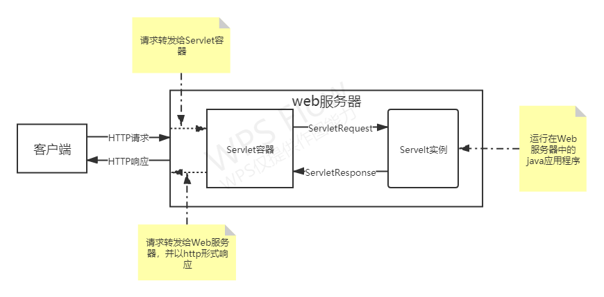
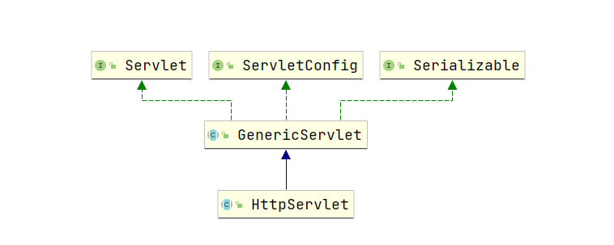
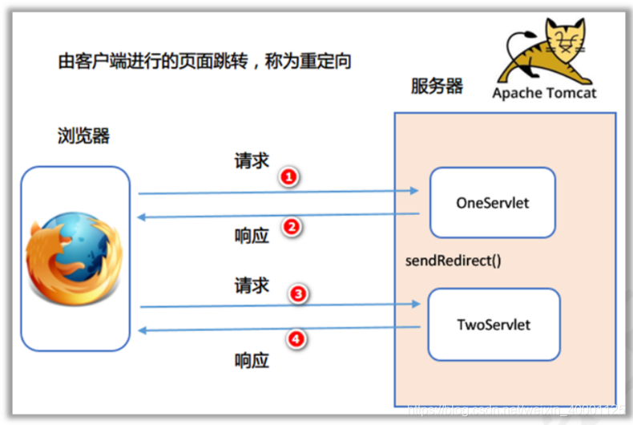
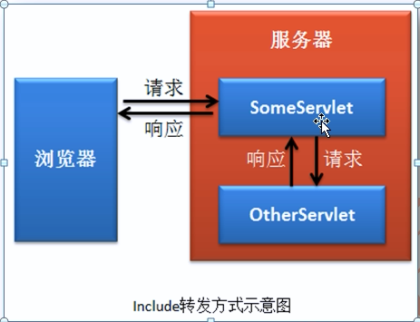
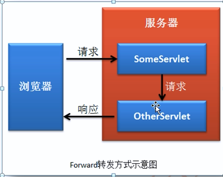

# Tomcat

## 1、Servlet历史 

​	20世纪90年代，互联网和浏览器飞速发展，基于浏览器的B/S模式开始火爆。起初web服务器只能返回静态资源，无法实现动态请求

#### CGI

​	Common Gateway Interface通用网关接口，**用于实现服务器对请求的动态处理**，由C、shell编写，并且不能移植。其作用过程：

1. WEB服务器接收一个用户请求；
2. WEB服务器将请求转交给CGI程序处理；
3. CGI程序将处理结果返回给WEB服务器；
4. WEB服务器把结果送回用户；

对于JAVA语言，实现web开发，也就需要类似CGI程序，因此就提供了Servlet：

#### applet

​	java进行web开发，起初是通过applet（java小型程序），来让浏览器解析web服务器响应回来的java代码，从而实现动态请求；而applet就是安装在浏览器的插件，但是，其性能非常低，每个请求都需要在浏览器端创建一个线程执行，并且响应传输的java代码不能太多和太复杂

#### Servlet

​	在applet之后，提供出Servlet（server applet），即实现在web服务器端执行java代码。其处理过程如下：

1. WEB服务器接收一个用户请求；
2. WEB服务器将请求转交给WEB服务器关联的Servlet容器；
3. Servlet容器找到对应的Servlet并执行这个Servlet；
4. Servlet容器将处理结果返回给WEB服务器；
5. WEB服务器把结果送回用户；

#### Jsp

​	随着Servlet的发展，SUN公司发现Servlet编程非常繁琐：

1、每个Servlet都有近似的代码，存在大量冗余

2、需要在Servlet中编写前端代码（Http页面），而这种编写方式非常不直观，不利于前端页面的开发

​	在Servlet1.1中，提出了JSP （java server page），实现在静态文件中插入编写后台代码，从而方便后台代码的编写，当着同样存在一些问题：

1、前后端代码都会编写在JSP文件中，导致代码非常混乱

#### MVC思想

​	在Servlet1.2中，提出了MVC思想：

1、Servlet（C）：Serlvet完成Controller功能，用于接收请求和部分简单代码处理

2、Model（M）：Serlvet将请求数据交给Model进一步处理，Model处理完请求数据后，会返回封装好的model数据，封装到Servlet的响应对象中，同时将请求重定向到指定了JSP页面，进行JSP页面渲染

3、JSP（V）：通过JSP标签来在指定model数据的渲染方式

这种方式将整个动态请求处理过程分为了3步，大大减少了JSP中的后端代码，并方便后端代码的复用

## 2、Servlet规范

### 1、定义

- 广义：

  ​	基于java技术，搭配容器托管，实现对http请求的动态处理；是javaweb开发的一个重要组件（另外两个JSP/JSF，因前后端分离而被淘汰）

- 狭义：

  ​	一个JAVAEE规范，定义了http服务器调用和管理动态资源规则，以及使用java进行动态资源开发过程

### 2、Servlet容器

​	Servlet容器（也称之为Servlet引擎）用于管理Servlet生命周期，提供基于请求/响应发送模型的网络服务，来解析MIME请求和格式化MIME响应。通常Servlet容器会嵌入在以java开发的web服务器中使用 （Tomcat），也可以基于组件的形式外置扩展。

​	请求处理过程如图：



Servlet容器会将请求封装为ServletApi中的HttpServletRequest对象，然后基于Servlet实例，调用器init（）、service（）方法对请求进行处理，输出HttpServletResponse对象，最后交给Servlet容器保证为http响应返回给客户端

### 3、web.xml文件

​	web.xml文件为web应用的部署描述文件（Deployment Descriptor），用于交给Servlet容器进行相关配置和部署，常用包括：

- ServletContext初始化参数
- session配置
- servlet、Filter、Listenner声明、映射、顺序和初始化参数

​       对于web应用程序的结构目录中，都会存在一个特殊的目录：**WEB-INF**

​	WEB-INF,该目录中的内容不能通过Servlet容器直接提供给客户端访问，只能交给Servlet、Servlet容器进行处理，一般用于存放web.xml文件、classes目录（编译后的class文件）和lib目录（外部jar包）

### 4、Servlet

#### 1、Servlet生命周期

​	Servlet的生命周期由容器管理，因此Servlet不能够用代码控制其生命

Servlet生命周期分为如下几步：

**1、加载和实例化：**

​	Servlet的加载和实例化发生在该Servlet的第一次请求时，因此常常说Serlvet容器启动后，第一次访问会较慢，但通过web.xml配置文件中的<load-on-startup> 1 <load-on-startup>标签，可以定义Servlet容器启动时，该Servlet的加载的优先级，当为0，则不进行加载

**2、初始化：**

​	Servlet初始化会紧跟在实例化后进行，即执行Servlet的init方法

**3、请求处理：**

​	初始化后，Servlet就能够进行请求处理，执行service方法；在httpServlet抽象类中，也提供doGet、doPost方法进行请求处理

**4、销毁：**

​	Servlet容器会在合适的时候对Servlet实例进行销毁，而该策略取决于容器；当容器关闭时，Servlet对象一定会被销毁，调用destroy方法

#### 2、Servlet接口相关对象和方法

Servlet在Servlet规范中，继承关系如下：



**Servlet接口：**

​	Servlet对象，定义了Servlet生命周期中所使用的方法

```java
public interface Servlet {
    //初始化方法
    void init(ServletConfig var1) throws ServletException;

    //获取servletConfig
    ServletConfig getServletConfig();

    //处理请求方法
    void service(ServletRequest var1, ServletResponse var2) throws ServletException, IOException;

    //获取Servlet相关信息
    String getServletInfo();

    //毁灭方法
    void destroy();
}
```

**ServletConfig接口：**

​	Servlet配置对象，在Servlet初始化期间，用于Servlet容器向Servlet传输数据

```java
public interface ServletConfig {

	//获取Servlet实例名
    public String getServletName();

	//获取ServletContext
    public ServletContext getServletContext();

	//获取Servle初始化参数  
    public String getInitParameter(String name);

	//获取Servlet初始化参数名集合
    public Enumeration<String> getInitParameterNames();
}
```

**GenericServlet抽象类：**

​	在初始化前，将ServletConfig作为成员变量保存，并通过ServletConfig对象实现相关接口方法

**HttpServlet抽象类：**  

​	基于Http协议通讯规范，将service请求处理方法，根据请求方法，划分为多个方法，等待被重写

#### 3、Servlet请求处理

​	当Servlet初始化后，Servlet容器就可以使用它来处理客户端请求。客户端请求会被封装为ServletRequest对象，并将最后需要返回的响应封装为ServletResponse对象，因此Servlet的service方法，其实就是对两个对象的处理

​	当在Http请求下，Servlet容器所提供给Servlet操作的对象分别为：HttpServletRequest和HttpServletResponse

- **请求并发处理：**

  ​	Servlet实例本身是线程不安全的。Servlet容器会通过一个工作线程池，来并发调用同一个Servlet实例的service方法。因此需要开发者以代码的形式，保证Servlet的线程安全：

  1、不能在Servlet中使用全局变量

  2、使用同步块synchronized，保证线程安全（这样会严重影响性能）

- **请求异步处理：** //todo

  ​	在web应用中，常常会由于某个请求处理时间过长(如JDBC连接超时），而导致该线程一直阻塞，这样会严重影响Servlet容器并发处理请求的。因此在Servlet3.0中，引入了异步请求处理功能

#### 4、Servlet配置

​		类继承HttpServlet，根据请求方法类型来重写指定方法，对ServletRequest、ServletResponse对象进行操作

```java
public class MyServlet extends HttpServlet {
	@Override
	protected void doGet(HttpServletRequest req, HttpServletResponse resp) throws ServletException, IOException {
		super.doGet(req, resp);
	}

	@Override
	protected void doPost(HttpServletRequest req, HttpServletResponse resp) throws ServletException, IOException {
		super.doPost(req, resp);
	}
}
```

在web.xml中，提供<Servlet>标签进行过滤器定义,它有三个子标签，来定义过滤器

- Servlet-name：过滤器名（保证唯一）
- Servlet-class：过滤器对应的类
- init-params：过滤器初始化参数

在web.xml中，提供<Servlet-mapping>标签进行过滤器的配置，它有三个子标签：

- Servlet-name：引入定义好的Servlet
- url-pattern：指定映射url，进行拦截处理

**在Servlet3.1中，提供@WebFilter注解简化Filter的配置**

#### 5、url-pattern映射规范

- 必须以/ 或者*开始，因为/代表了Servlet应用的根目录
- /*结束表示匹配后续所有路径
- *.html 后缀匹配的优先级低于路径匹配

### 5、ServletContext

​	ServletContext（Servlet上下文），Servlet容器会为每个web项目创建一个该对象。它全局唯一，所有servlet都共享该对象，因此也被称为**全局应用程序共享对象**

**作用：**

1、作为全局对象，能够实现在不同动态资源（Servlet）间传递和共享数据

```java
public Object getAttribute(String name);

public Enumeration<String> getAttributeNames();

public void setAttribute(String name, Object object);

public void removeAttribute(String name);
```

2、可以读取和配置全局初始化参数

```java
public boolean setInitParameter(String name, String value);

public Enumeration<String> getInitParameterNames();

public String getInitParameter(String name);
```

3、获取web应用下的资源文件

```java
public URL getResource(String path) throws MalformedURLException;

public InputStream getResourceAsStream(String path);
```

4、控制Servlet容器配置和部署

- 对Servlet、Filter、Listenner组件的管理
- 对Servket容器中，请求、响应的编码格式、session超时时间进行管理

**在Servlet容器中，使用ApplicationContext类对ServletContext接口进行实现**

### 6、ServletRequest

​	请求对象，用于封装客户端请求的所有信息。在HTTP协议中，将请求转为了 `HttpServletRequest`对象，封装http请求头和消息体消息

​	Request是请求对象的实现类，其接口继承包括：HttpServletRequest》》ServletRequest

#### 1、HTTP协议参数

​	Sevlet容器会将RUI和postBody中的参数，以K-V键值对的形式保存到`HttpServletRequest`对象中，并且同一个key可以对应多个value，在`ServletRequest`接口中，提供如下方法，来访问这些参数：

```java
//获取所有参数key
public Enumeration<String> getParameterNames();

//获取key对应的value数组
public String[] getParameterValues(String na
 public String getParameter(String name);me);

//获取所有的key-value参数
public Map<String, String[]> getParameterMap();

//获取key对应value数组的第一个值
public String getParameter(String name);
```

- **注意：**

  ​	对于HTTP1.1所定义的路径参数，必须通过getRequestURI/getPathInfo获取uri，然后手动解析内部传参

##### 1.1、post表单传参

- K-V键值对

​	必须保证content-type=application/x-www-form-urlencoded，并当调用用参数方法时，Servelt内部才会懒加载，读取请求输入流，进行表单中的参数绑定；之后Post请求的输入流也就无法使用

#### 2、文件上传

必须保证content-type=multipart/form-data,然后通过`HttpServletRequest`接口中的如下方法，进行文件访问

```java
//获取所有文件
public Collection<Part> getParts() throws IOException,
            ServletException;

//根据文件名获取指定文件
public Part getPart(String name) throws IOException,
            ServletException;

```

#### 3、属性

​	Request中的属性并不是由Http协议提供，而是通过Servelt容器进行设置，用于Servelt之间的数据传递。在`ServletRequest`接口中提供如下方法，进行操作：

```java
//获取请求中的所有属性名
public Enumeration<String> getAttributeNames();

//获取请求中的指定key的属性值
public Object getAttribute(String name);

//设置当前请求中的属性
public void setAttribute(String name, Object o);
```

#### 4、请求头

​	`HttpServletRequest`接口提供如下方法，来获取http请求中的头信息，Http请求头允许多个请求头name重复

```java
//获取所有请求头name
public Enumeration<String> getHeaderNames();

//获取指定请求头对应值的数组
public Enumeration<String> getHeaders(String name);

//获取指定请求头对应的第一个值
public String getHeader(String name);
```

​	Http请求头都会以String形式进行封装，HttpServletRequest接口提供如下方法，支持String对Date、int类型的转换(转换失败，则抛出异常)

```java
public int getIntHeader(String name);

public long getDateHeader(String name);
```

#### 5、请求路径传参

​	Servlet容器将请求路径分为了三个部分：

- ContextPath，Servlet容器的上下文路径，默认为/

- ServletPath，用于进行Servlet匹配映射的路径

- PathInfo，ContextPath、ServletPath除外后的路径，如果没有，则为null或者为/

  因此：requestURI=contextPath+servletPath+pathInfo

注意：

​	**对于.xx文件名结尾的路径，pathInfo为null，ServletPath就是该文件在项目中的路径**

在`HttpServletRequest`接口中，提供如下方法，来访问该三种路径和完整的URI和URL:

```java
public String getRequestURI();

public StringBuffer getRequestURL();

public String getContextPath();

public String getServletPath();

public String getPathInfo();
```

#### 6、非阻塞IO

​	Servelt 容器在进行异步请求和升级处理时，使用非阻塞IO来提高web容器并发量；在进行http请求数据的读取时，ServletInputStream提供一系列方法，来读取http请求数据

```java
public ServletInputStream getInputStream()    通过request获取http请求输入流

boolean isFinished();//判断是否数据读取完成

boolean isReady();//判断数据是否可以被无阻塞读取

void setReadListener(ReadListener listener)；//设置数据流读取监听器，进行方法回调
```

通过`ReadListener `来为`ServletInputStream`的数据读取提供一系列回调方法：

```java
onDataAvailable()；//当数据可以被读取时，进行回调

onAllDataRead()；//当数据读取完时，进行回调
 
onError(Throwable t)；//数据读取发生错误时，进行回调
```

#### 7、cookie

​	request通过getCookies方法，来获取请求中的cokie数组，它有一个个KV组成，服务器可以进行set并返回给浏览器，其中服务器会通过cokie中的sessionId来判断用户。

​	一般情况下，浏览器会将cookie设置为httpOnly cookie，防止暴露给客户端脚本，减少XSS风险

#### 8、SSL属性

​	对于https请求，会携带SSL属性数据，在Servlet容器中，会以java.security.cert.X509Certificate 类型的对象数 进行封装，交给开发者进行操作，并存放在Request对象的attribute属性中，key为：javax.servlet.request.X509Certificate

#### 9、国际化

​	http可以通过Accept-Language头和HTTP/1.1规范中的相关机制，来表示客户端的首选语言环境，并在Request中，以getLocale方法进行获取

#### 10、请求数据编码

​	对于get请求参数数据，会经过Servlet容器处理，封装到request对象的Parameter中，并且Servlet容器默认使用ISO-8859-1编码，将二进制数据进行编码，因此此时直接调用getParameter会导致中文乱码，只能对字符串进行ISO-8869-1解码，然后再进行UTF-8的编码

​	对于Post请求参数，并不会被Servlet容器预处理，而是在读取请求被处理时，根据content-type头进行选择处理，如果不进行指定，则默认使用ISO-8859-1进行post数据获取；为了避免无法解析，Request对象提供setCharacterEncoding（String enc）方法来指定解析数据的编码格式，**在post数据读取前执行**

#### 11、Request对象生命周期

​	每个Request对象都只能在Servlet的service方法，或过滤器的doFilter方法的作用域内有效；除非通过调用request.startAsync方法，实现请求异步处理；此时，request对象一直有效，直到执行AsyncContext.complete方法

### 7、ServletResponse

​		响应对象,封装了服务器返回客户端的所有信息,在HTTP协议中,`将请求转为了 `HttpServletRequest`对象`，封装响应头和响应的消息体

​		Response是响应对象的实现类，其接口继承包括：HttpServletResponse》》ServletResponse

#### 1、缓冲

​		Servlet容器提供服务器缓冲功能，通过Response对象api实现

```java
//获取缓冲区大小
public int getBufferSize()  
//设置缓冲区大小    
public void setBufferSize(int size)
//刷新提交缓冲区数据    
public void flushBuffer()
//响应数据是否提交
public boolean isCommitted()
//清除缓冲区所有数据
public void reset()
//清除缓冲区所有数据,但不包括响应头
public void resetBuffer()
```

缓冲区大小设置,必须在ServletOutputStream/Writer写入数据前,否则会抛出IllegalStateException异常

如果缓冲区数据达到最大值,则会将数据输出到客户端,并认为响应已被提交;此时如果调用reset\resetBuffer方法,则会抛出IllegalStateException异常

#### 2、响应头

HttpServletResponse提供api进行HTTP响应头操作

```java
//设置响应头(如果响应头存在，则覆盖)
public void setHeader(String name, String value)
//添加响应头（如果响应头存在，则添加额外一个同名响应头）
public void addHeader(String name, String value)
```

​	**相同响应头数据，会通过set集合保存value值，最后通过逗号分割展示**

除了默认的String类型的value值外，还提供date、int类型数据的header值设置

#### 3、非阻塞IO

​	Servelt 容器在进行异步请求和升级处理时，支持非阻塞写；在进行http响应数据的写入时，ServletOutputStream提供一系列方法，来写入http响应数据

```java
boolean isReady();//判断数据是否可以被无阻塞写入

void setWriteListener(WriteListener listener)；//设置数据流写入监听器，进行方法回调
```

通过WriteListener `来为`ServletOutputStream`的数据读取提供一系列回调方法：

```java
onWritePossible()；//当数据可以被写入时，进行回调
 
onError(Throwable t)；//数据写入发生错误时，进行回调
```

#### 4、重定向和错误

​		HttpServletResponse提供api，实现重定向和错误响应

- sendRedirect

  ​		将设置了header和内容体的响应重定向到另外一个url，url支持相对路径(在当前url的基础上拼接),但是必须要保证该url路径有效

  **原理：**重定向由客户端完成，本质上是两次请求；第一次请求服务器进行响应，返回重定向的地址；第二次则请求重定向地址，因此第一次请求域数据会丢失

  

- sendError

  ​		将设置了header和内容体以响应错误的方式返回客户端，客户端自己重定向到服务器设置好的标准错误页面（404.html、500.html）

#### 5、国际化

​		HttpServletResponse提供api，设置local和字符集

```java
//设置响应头-ContentType，告诉浏览器响应内容的类型（MEMI类型）和编码格式
//同时设置Servlet容器保存数据的编码格式 
public void setContentType(String type) 
//设置Servlet容器保存数据的编码格式 
public void setCharacterEncoding(String charset)
//设置locale
public void setLocale(Locale locale)
```

在没有调用setContentType、setCharacterEncoding方法时，设置locale可以改变字符集

#### 6、结束响应对象

​		在响应关闭时，缓冲区数据会立即将数据提交给客户端，如下情况时，响应会关闭：

- servlet的service方法执行完成（完成正常响应流程）
- 调用sendError、sendRedirect方法，执行完成
- AsyncContext.complete方法调用（完成异步处理）

#### 7、Response对象生命周期

​	每个Response对象都只能在Servlet的service方法，或过滤器的doFilter方法的作用域内有效；除非通过调用request.startAsync方法，实现请求异步处理；此时，Response对象一直有效，直到执行AsyncContext.complete方法

### 8、Filter

​		过滤器Filter为Java组件，允许在资源请求和响应过程中，修改header和负载；是一种代码重用技术，常用场景包括：

- 验证过滤器
- 日志记录
- 数据预处理（图像转化、数据压缩、加密、转化）
- 缓存过滤器

#### 1、生命周期

​		Servlet提供Filter接口，来定义创建过滤器，并在web.xml部署描述符中进行配置，过滤指定映射的Servlet

```java
//初始化方法
public default void init(FilterConfig filterConfig) throws ServletException {}

//过滤处理方法
public void doFilter(ServletRequest request, ServletResponse response,
            FilterChain chain) throws IOException, ServletException;

//销毁方法
public default void destroy() {}
```

​		Filter整个生命周期为：

- Servlet容器初始化后，创建Filter实例，调用init初始化方法

- 请求传入Servlet容器后，交给过滤器链处理
- 调用第一个Filter的doFilter方法，将请求、响应对象包装为ServletRequest、ServletResponse，对其进行相应处理
- 当执行FilterChain.doFilter()方法后，将请求交给下一个Filter，直到最后一个后，目标为最终的Web资源
- 然后按之前相反顺序向上跳出doFilter（）方法，最后返回给客户端响应

- Servlet容器关闭时，调用destroy销毁方法

**处理请求的serivce方法和过滤器链都允许在同一个线程中**

#### 2、过滤器配置

在web.xml中，提供<filter>标签进行过滤器定义,它有三个子标签，来定义过滤器

- filter-name：过滤器名（保证唯一）
- filter-class：过滤器对应的类
- init-params：过滤器初始化参数

在web.xml中，提供<filter-mapping>标签进行过滤器的配置，它有三个子标签：

- filter-name：引入定义好的Filter

- url-pattern：指定映射url，进行拦截处理

- servlet-name：指定拦截的Servlet

  url-pattern、servlet-name可以同时指定多个，并且servlet-name匹配对应的过滤器永远为最后一个（允许一个过滤器被多次匹配，同样也会按照顺序多次处理请求）

**在Servlet3.1中，提供@WebFilter注解简化Filter的配置**

#### 4、过滤器和RequestDispatcher

​		在Servlet2.4后，过滤器配置支持识别请求是否被RequestDispatcher分发，从而进行更加细致化的匹配拦截

在web.xml的filter-mapping标签中，使用dispatcher子标签值进行约束：

- REQUEST：请求直接来自于客户端，默认值

- FORWARD：请求被请求分派器的forward（）方法调用处理

- INCLUDE：请求被请求分派器的include（）方法调用处理

- ERROR：请求被错误页面机制处理

- ASYNC：请求被异步处理

  dispatcher子标签可以指定多个，并集关系

### 9、Session

​		由于Http是一种无状态协议，无法将请求与指定客户端绑定，因此在服务器和浏览器之间就创建一种额外的机制，会话；**它是对Http协议的扩展，实现服务器对用户整个会话的追踪和记录**；在Servlet规范中，提供HttpSession接口进行实现

#### 1、会话跟踪机制原理

​		会话机制的实现，通过客户端的Cookie和服务端的Session共同完成

在Http响应头中，通过Set-Cookie来传输服务端传递给客户端的Cookie信息，Servlet容器默认创建一个Cookie：

```java
Set-Cookie: JSESSIONID=07CA5FA20FB2B28A3AF3A385A2D2693D; Path=/; HttpOnly
```

- JSEEIONID 为cookie的标准name，用于浏览器回传cookie时，服务端通过sessionId与其对应，进行session绑定
- path 表示当前域下，哪些请求可以访问传递cookie， /表示任何请求
- HttpOnly 表示cookie不能在浏览器中，被js脚本获取

在后续客户端的请求发送时，都会自动通过cookie请求头，来传递cookie中的name-value键值对；服务端通过解析name=JSEEIONID的cookie值，来绑定会话，实现会话跟踪

#### 2、Cookie属性和使用

​	除了cookie本身的K-V键值对、HttpOnly、Path外，还提供其他属性，来定义cookie在浏览器中的作用范围：

- maxAge：告诉浏览器，该cookie的失效时间
- secure：告诉浏览器，该cookie是否必须使用安全协议传输，如SSL
- domain：告诉浏览器，允许访问该cookie的域名

​	Cookie可以指定多个，通过其KV来保存客户端信息，除了实现会话追踪外，还能进行不同Servlet之间的数据交换，Cookie包含如下特征：

- 不可跨越
- 使用Unicode编码传输，支持中文

#### 3、会话的生命周期

- 创建：

  ​		当开发者手动调用getSession（）、getSession（true），就会返回一个session（如果没有，就会创建），并保持在服务端，此时Servlet容器就会自动创建一个name=JSEEIONID的cookie，返回sessionId，从而实现会话追踪

- 销毁：

  ​		在Http协议中，客户端并没有显示的终止信号，来提示服务端关闭会话，因此会话超时时终止会话的唯一机制。Servlet容器定义了一个默认的会话超时时间（30分钟），通过`HttpSession`接口中的相关方法，可以获取和自定义：

  ```java
  //获取最后一次访问时间
  public long getLastAccessedTime();
  //设置会话超时时间
  public void setMaxInactiveInterval(int interval);
  //获取会话超时时间
  public int getMaxInactiveInterval();
  ```

  当超时时间=-1时，会话永不过期，直到Servlet容器关闭

#### 4、URL重写

​		由于cookie可能会被浏览器禁用，此时就无法实现session的绑定；因此Servlet提供另外一种方式，来完成SessionId的回传。但相对于cookie，需要开发者手动进行传递，并且会暴露会话标识

URL重写的实现方式：在URL后面添加 ;jseeionid=xxxx

```java
http://www.myserver.com/catalog/index.html;jsessionid=1234
```

#### 5、Session属性

​		`HttpSession`接口提供一系列方法，实现session会话内的数据交换

```java
//获取指定属性值
public Object getAttribute(String name);

//获取所有属性名
public Enumeration<String> getAttributeNames();

//设置属性
public void setAttribute(String name, Object value);

//删除属性
public void removeAttribute(String name);
```

​		Session本身通过Servlet容器来保证线程安全，因此多个请求线程访问同一个属性时，不需要额外处理；**但是对于属性中的对象，对其进行的操作，并不是线程安全的；因此对于该对象的成员变量修改，必须由开发者添加线程同步机制**

如：

```java
	UserInfoDTO user = (UserInfoDTO)session.getAttribute("user");
		synchronized (user){
			user.setUsername("YH");
		}	
```

### 10、RequestDispatcher

​		在web应用中，存在请求转发功能。而在Servlet中，通过`RequestDispatcher`就能实现将请求转发给另一个Servlet处理

#### 1、RequestDispatcher的获取

- 通过`ServletContext`来获取`RequestDispatcher`对象：

```java
//根据Servlet映射路径，获取对应的Servlet对象，并将其封装为RequestDispatcher
public RequestDispatcher getRequestDispatcher(String path);

//根据ServletName，获取对应的Servlet对象，并将其封装为RequestDispatcher
public RequestDispatcher getNamedDispatcher(String name);
```

- 通过`ServletRequest`来获取ReqeustDispatcher对象：

```java
//基于当前请求的URL，使用path来作为另外一个Servlet映射（资源）的相对路径
public RequestDispatcher getRequestDispatcher(String path);
```

#### 2、转发方式

​	RequestDispatcher提供两种转发方式，Include（包含）和forward（转发）

- **Include方法**

  ​		该方法会对Response进行限制，转发后的资源只能操作response对象中的输出对象（ServletOutputStream、Writer），不能修改response其他属性,如设置响应头等

  **原理：**第一个资源对请求直接进行响应,并开启输出流,但输出流的数据有第二个资源进行提供

  

- **Forward方法**

  ​		该方法必须保证Response缓冲区未提交过数据，并且在调用转发后的Servlet.service方法前，缓冲区数据需要被清除

  **原理：**第一个资源完全将请求转发到另外一个资源上,进行处理、响应
  
  

#### 3、转发时的参数处理

- 当该RequestDispatcher是通过getRequestDispatcher进行获取时，可以通过path来修改请求相关参数，如果出现重复，则进行覆盖
- 使用getNamedDispatcher时，则参数不能修改

#### 4、请求异步处理时的转发

​		通过AsyncContext的dispatch（）方法，可以实现请求异步处理时的转发，必须保证当前异步请求未调用complete（）方法

### 12、Listener

​		Servlet提供事件监听器（Listener），来更好的控制SerlvetContext、HttpSession、ServletRequest的生命周期

Servlet中常用事件监听器对应的接口和监听事件：		

| Listener接口                    | 监听事件                                                     |
| ------------------------------- | ------------------------------------------------------------ |
| ServletContextListener          | 监听ServletContext的创建和销毁，并可以监听Servlet容器的第一个请求 |
| ServletContextAttributeListener | 监听ServletContext中的Attribute属性变化（增删改）            |
| HttpSessionListener             | 监听Session会话的创建、销毁、超时                            |
| HttpSessionAttributeListener    | 监听Session中的Attribute属性变化（增删改）                   |
| ServletRequestListener          | 监听ServletRequest请求的初始化和销毁                         |
| ServletRequestAttributeListener | 监听ServletRequest中的Attribute属性变化（增删改）            |
| AsyncListener                   | 监听异步请求处理的开始、完成、错误和超时                     |

​		监听器常用场景包括：初始化和关闭数据库连接、servlet访问日志记录、用户在线统计等

​		在Web.xml中，直接提供<listener> 标签，使用全类名来配置监听器

**在Servlet3.1中，提供@WebListener注解简化Listener的配置**

### 13、Servlet3.0常用注解

- **@WebServlet**

  ​		用于定义Servlet组件，必须指定urlPatterns属性，name不指定时，默认使用全类名；所注解的类必须继承javax.servlet.http.HttpServlet类

  ```java
  @WebServlet(name=”MyServlet”, urlPatterns={"/foo", "/bar"}) 
  public class SampleUsingAnnotationAttributes extends HttpServlet{ 
  public void doGet(HttpServletRequest req, HttpServletResponse res) { 
   } 
  }
  ```

- **@WebFilter** 

  ​		用于定义Filter组件，必须指定urlPatterns属性，name不指定时，默认使用全类名；所注解的类必须继承javax.servlet.Filter类

  ```java
  @WebFilter(“/foo”) 
  public class MyFilter implements Filter { 
  public void doFilter(HttpServletRequest req, HttpServletResponse res) { 
  } 
  }
  ```

- **@WebListener** 

  ​		用于定义Listener组件，必须指定urlPatterns属性，name不指定时，默认使用全类名；所注解的类必须继承相关监听接口

  ```java
  @WebListener 
  public class MyListener implements ServletContextListener{ 
   public void contextInitialized(ServletContextEvent sce) { 
   ServletContext sc = sce.getServletContext(); 
   //通过ServletContext对象，以编程式手动配置Servlet
   sc.addServlet("myServlet", "Sample servlet", "foo.bar.MyServlet", null, -1); 
   sc.addServletMapping("myServlet", new String[] { "/urlpattern/*" }); 
   } 
  }
  ```